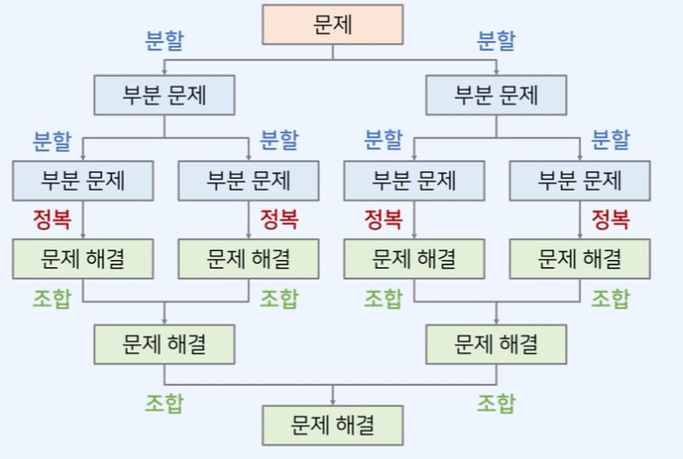
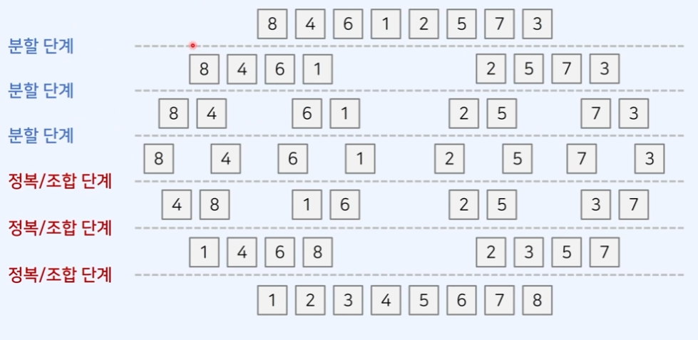
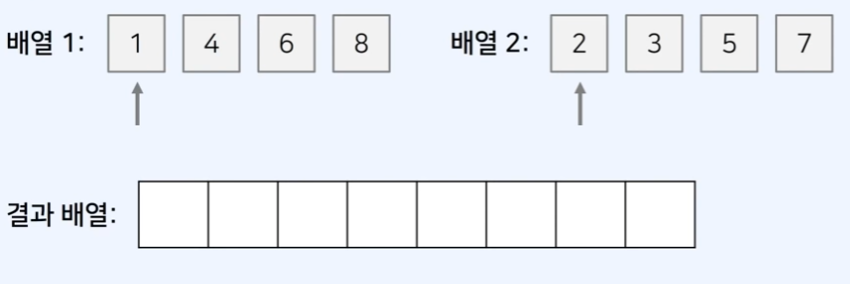

## 비교적 비효율 적인 정렬 알고리즘의 종류

정렬 알고리즘 중 가장 기본이 되는 알고리즘으로, 배열을 정렬하는 알고리즘 중 시간 복잡도 *O(N^2)* 을 가지는 알고리즘 입니다.

- 선택 정렬
- 버블 정렬
- 삽입 정렬

### 선택 정렬


> 이미지 출처 : [https://ko.wikipedia.org/wiki/선택_정렬](https://ko.wikipedia.org/wiki/%EC%84%A0%ED%83%9D_%EC%A0%95%EB%A0%AC)

[선택 정렬](https://ko.wikipedia.org/wiki/선택_정렬)

선택 정렬은 **매 단계**에서 가장 작은 원소를 **선택**해서 앞으로 보내는 정렬 방법 입니다.

**동작 방식**은 아래와 같습니다.

1. 각 단계에서 가장 작은 원소를 선택 합니다.
2. 현재까지 처리되지 않은 원소들 중 가장 앞의 원소와 위치를 교체합니다.

**가장 작은 원소가 맨 왼쪽으로 이동**한다고 이해 할 수 있습니다.

**소스 코드 예시**

```jsx
function selectionSort(arr){
	for(let i = 0; i <arr.length; i++) {
		let minIndex = i; // 가장 작은 원소의 인덱스
		for(let j = i + 1; j < arr.length; j++){
			// 1. 각 단계에서 가장 작은 원소를 선택 합니다.
			if(arr[minIndex] > arr[j]){
				minIndex = j;
			}
		}
		// 2. 현재까지 처리되지 않은 원소들 중 가장 앞의 원소와 위치를 교체합니다.
		let temp = arr[i];
		arr[i] = arr[minIndex];
		arr[minIndex] = temp;
	}
}
```

이미 정렬된 배열에 대한 시간 복잡도가 정렬되지 않은 배열과 시간이 비슷하게 소요 되기 때문에 비효율 적이라고 볼 수 있다.

매 단계에서 가장 작은 것을 선택하는 데에 약 *N*번의 연산이 필요하기 때문입니다. (선형 탐색)

결과적으로 최악의 경우 O(N^2)의 시간 복잡도를 가집니다.

<br />

---

<br />

### 버블 정렬


> 이미지 출처 : [https://velog.io/@scantykneesocks/Bubble-Sort버블-정렬](https://velog.io/@scantykneesocks/Bubble-Sort%EB%B2%84%EB%B8%94-%EC%A0%95%EB%A0%AC)
> 

[버블 정렬](https://ko.wikipedia.org/wiki/버블_정렬)

서로 인접한 두 원소를 비교하는 형태가 마치 **거품** 같다고 하여 붙여진 이름이 버블 정렬입니다.

단순히 **인접한 두 원소**를 확인하여, 정렬이 안되어 있다면 **위치를 서로 변경**하는 알고리즘 입니다.

선택 정렬과 마찬가지로 시간 복잡도 *O(N^2)*인 비효율적인 정렬 알고리즘 중 하나 입니다.

**동작 방식**

1. 각 단계 에서는 인접한 두 개의 원소를 비교하여, 필요 시 위치를 변경합니다.
2. 첫째와 둘째를 비교, 둘째와 셋째를 비교, 셋째와 넷째를 비교… 순으로 비교하는 방식입니다.

즉 한번의 단계가 수행 되면 가장 큰 원소가 맨 뒤로 이동하게 됩니다.

그 다음 단계에서는 맨 뒤로 이동한 데이터는 정렬에서 제외합니다. 그래서 각 단계를 거칠 때마다 **큰 값을 확실하게** 결정하는 것으로 이해 할 수 있습니다.

**소스 코드 예시**

```jsx
function bubbleSort(arr){
	// 맨 뒤로 큰 값을 하나씩 확실하게 결정
	for(let i = arr.length - 1; i > 0; i--){
		// 2. 첫째와 둘째를 비교, 둘째와 셋째를 비교, 셋째와 넷째를 비교…
		for(let j = 0; j < i; j++){
			// 1. 인접한 두 개의 원소를 비교하여, 필요 시 위치를 변경
			if(arr[j] < arr[j + 1]){
				let temp = arr[j];
				arr[j] = arr[j+1];
				arr[j+1] = temp;
			}
		}
	}

}
```

선택 정렬과 마찬가지로 이미 정렬된 배열과 정렬되지 않은 배열의 소요 시간이 비슷해서 비효율적인 알고리즘으로 알려져 있습니다.

마찬 가지로 시간 복잡도 *O(N^2)*을 보장합니다.

<br />

---

<br />

### 삽입 정렬


> 이미지 출처 : [https://ko.wikipedia.org/wiki/삽입_정렬](https://ko.wikipedia.org/wiki/%EC%82%BD%EC%9E%85_%EC%A0%95%EB%A0%AC)
> 

[삽입 정렬](https://ko.wikipedia.org/wiki/삽입_정렬)

각 숫자를 **적절한 위치에 삽입**한다 하여 삽입 정렬이라는 이름을 가지고 있습니다.

처음에 첫 번째 원소는 정렬이 되어 있다고 가정하고 시작합니다. 그리고, 각 단계마다 현재 위치를 바꾸지 않고 놔둘지 바꿀지를 연산 합니다.

정렬이 필요한 요소를 찾으면 정렬이 완료되었다고 가정한 왼쪽 배열 중에서 **어느 위치**로 들어갈지 골라서 들어간다 해서 **선택** 정렬이라고 생각하면 좋습니다.

**동작 방식**

1. 각 단계에서 현재 원소가 삽입될 위치를 찾습니다.
2. 적절한 위치에 도달할 때까지 반복적으로 왼쪽으로 이동합니다.

즉 요소를 하나씩 확인해서 그 원소가 어느 위치에 삽입이 되야 하는지 확인 하고 그 위치에 삽입이 될때까지 반복적으로 왼쪽으로 이동합니다.

**소스 코드 예시**

```jsx
function insertionSort(arr){
	for(let i = 1; i < arr.length; i++){
		for(let j = i; j > 0; j--){
			// 인덱스 j부터 1까지 1씩 감소하며 반복
			if(arr[j] < arr[j-1]){
				// 한 칸씩 왼쪽으로 이동
				// 스와프
				let temp = arr[j];
				arr[j] = arr[j-1];
				arr[j-1] = temp;
			} else {
				// 자기 보다 작은 데이터를 만나면 그 위치에서 멈춤
				break;
			}
		}
	}
}
```

삽입 정렬의 경우 이미 정렬이 완료된 배열의 경우 매우 빠르게 동작하는 알고리즘 입니다.

자기보다 작은 데이터를 만나면 그 즉시 동작을 멈추기 때문입니다.

<br />

---

<br />

## 조금 더 효율적인 정렬 - 병합 정렬

현존하는 정렬 알고리즘 중 빠르게 동작하는 알고리즘 중 하나 입니다.

병합 정렬은 전형적인 분할 정복(Dvide and Conquer) 알고리즘 입니다.

시간 복잡도 *O(NlogN)* 을 보장합니다.

> **분할 정복(Dvide and Conquer)**
**분할**(divide): 큰 문제를 작은 부분 문제(쉬운 문제)로 분할 한다.
**정복**(conquer): 작은 부분 문제를 각각 해결한다.
**조합**(combine): 해결한 부분 문제의 답을 이용하여 다시 큰 문제를 해결한다.
> 

분할 정복은 일반적으로 재귀 함수를 이용하여 구현합니다.

그 이유는 큰 문제를 작은 문제로 **분할하는 방식이 동일한** 경우가 많기 때문입니다.

더 이상 쪼갤 수 없는 크기가 될 때까지 계속하여 분할 합니다.

분할 정복의 단점

일반적으로 재귀 함수를 사용한다는 점에서 함수 호출 횟수가 많이 발생합니다. 이는 **오버헤드**로 이어지곤 합니다.

### 병합 정렬의 동작 방식

1. 분할(divide): 정렬할 배열(큰 문제)을 같은 크기의 부분 배열(작은 문제) 2개로 분할 합니다.
2. 정복(conquer): 부분 배열을 정렬합니다. (작은 문제를 해결한다.)
3. 조합(combine): 정렬된 부분 배열을 하나의 배열로 다시 병합합니다.





첫째 원소부터 시작하여 하나씩 확인 합니다. 더 작은 값을 먼저 넣고 둘중 더 큰 값을 그다음 넣는 식으로 진행하면 결과 배열에는 정렬된 배열이 완성된다.



높이는 *O(logN)* 이고, 너비가 *O(N)인 사각형과 유사합니다.*

따라서 최악의 경우에도 시간 복잡도 O(NlogN)을 보장 합니다.

효율적인 알고리즘 이지만 정복(conquer) 과정에서 임시 배열이 필요해서 메모리를 많이 사용할 가능성이 있습니다.

```jsx
function merge(arr, left, mid, right){
  let i = left;
  let j = mid + 1;
  let k = left; // 결과 배열의 인덱스

  while(i<= mid && j <= right){
    if(arr[i] <= arr[j]) sorted[k++] = arr[i++];
    else sorted[k++] = arr[j++];
  }
  // 왼쪽 배열에 대한 처리가 다 끝난 경우
  if(i > mid) {
    for(; j <= right; j++) sorted[k++] = arr[j];
  }
  // 오른쪽 배열에 대한 처리가 다 끝난 경우
  else {
    for(; i <= mid; i++) sorted[k++] = arr[i];
  }
  // 정렬된 배열 결과를 원본 배열에 반영하기
  for(let x = left; x <= right; x++){
    arr[x] = sorted[x];
  }
}

function mergeSort(arr, left, right){
  // 원소가 1개인 경우, 해당 배열은 정렬이 된 상태로 이해 가능합니다.
  if(left < right) {
    // 원소가 2개 이상이라면
    let mid = parseInt((left + right)/2); // 2개의 부분 배열로 분할(divide)
    mergeSort(arr, left, mid); // 왼쪽 부분 배열 정렬 수행(conquer)
    mergeSort(arr, mid + 1, right); // 오른쪽 부분 배열 정렬 수행(conquer)
    merge(arr, left, mid, right); // 정렬된 2개의 배열을 하나로 병합(combine)
  }
}
```

### 다른 병합 정렬 예시

```jsx
const merge = function (left, right) { // 정렬된 왼쪽과 오른쪽 배열을 받아서 하나로 합치는 순수한 함수
	// left, right already sorted
	const result = [];
	while (left.length !== 0 && right.length !== 0) {
		left[0] <= right[0] ? result.push(left.shift()) : result.push(right.shift());	
	}

	return [...result, ...left, ...right]; // 아래 세줄과 같은 역할을 하는 코드
    // if(left.length === 0) results.push(...right);
    // if(right.length === 0) results.push(...left);
    // return results;
}

const mergeSort = function (array) {
	// ending condition: length === 1 인 배열이 들어올 때, 정렬이 끝난 것. 
	if (array.length === 1) return array;

	// 2로 나누고 내림을 해야
	// length 가 2일 때도 안전하게 배열을 slice 할 수 있다.
	const middleIndex = Math.floor(array.length / 2); 
	const left = array.slice(0, middleIndex);
	const right = array.slice(middleIndex);

	// 재귀로 계속해서 반으로 나누면서 length 가 1이 될때까지 쪼개고, 
	// 거꾸로 올라오면서 순수한 함수인 merge에 인자로 넣어서 다시 병합되어서 최종값을 리턴한다.
	return merge(mergeSort(left), mergeSort(right));
}

const arr = [4, -1, 0, -8, 0, 8, 91, 2, 3, 4, 98, 911, 21];

const result = mergeSort(arr);
console.log(result);
```