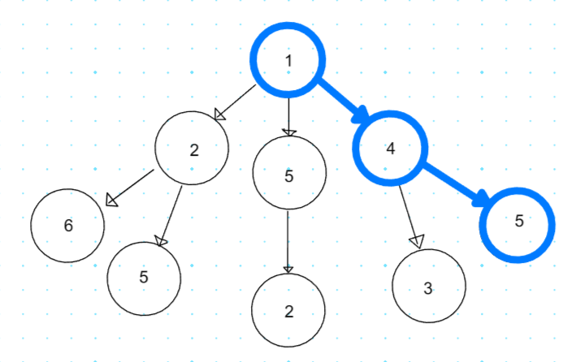
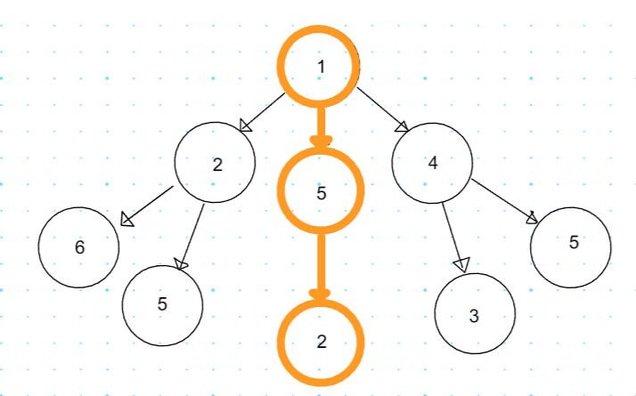

## 가장 좋은 상황을 고르는 알고리즘: 탐욕법(greedy)

현재 상황에서 당장 가장 좋아 보이는 상황만을 선택하는 알고리즘을 뜻합니다.

흔히 그리디 알고리즘 혹은 탐욕법 알고리즘으로 불립니다.

주로 최적의 해와 근사치를 구할 때 사용 될 때가 많습니다.

### 탐욕 알고리즘 예시

루트에서 출발해 단말 노드 까지 가는 경우에 거쳐가는 노드의 합이 가장 큰 경우를 구한다고 한다면?

**최적의 해**를 구한다면 아래와 같이 **`10`이** 나오는 경로가 가장 큰 합을 가지고 있다.

이와 같은 값을 얻으려면 모든 경로를 **완전 탐색**해서 구할 수 있습니다.

어디로 갈지 선택해야 하는 상황이 오면 가장 큰 노드를 선택 하는 **탐욕법을 이용**하면 

아래와 같이 루트 노드에서 갈 수 있는 노드 중에 가장 큰 노드는 `5`이기 때문에 5를 선택하여 진행합니다. 큰 그림을 보는 것이 아니라 **매 상황 마다 가장 큰 값** 만을 쫒기 때문에 최적의 해는 구하지 못했지만 **근사치인 `8`**를 구할 수 있었습니다.

최적의 해와는 거리가 있지만 시간 복잡도 에서는 유리해서

조금 더 빠르게 **최적의 해와 가까운 근사해**를 구할 수 있는 장점이 있습니다.

### 탐욕 알고리즘의 근사 해

현실 세계의 많은 상황에서는 단순한 탐욕 알고리즘 만으로는 최적의 해는 구하기 어렵습니다.

그러나 최적의 해에 가까운 값을 빠르게 구할 수 있어서 근사해를 구하는 목적으로 사용되곤 합니다.

### 코딩 테스트에서의 탐욕 알고리즘

보통 탐욕법 만으로도 최적의 해가 보장되는 문제들 에서 많이 사용됩니다.

코딩 테스트에서 문제가 출제 될 때는 주어진 값, 답을 모두 알고 있기 때문에 탐욕법으로 나온 답과 주어진 답이 같은지 확인해서 탐욕법만으로 최적의 해가 보장되는지를 알 수 있다.

### 탐욕 알고리즘의 접근 방법

1. **방법 고안하기** : 현재 상황에서 어떤것을 선택할지 알고리즘을 고안 합니다.
2. **정당성 확인하기** : 자신이 고안한 알고리즘이 항상 최적의 해를 보장하는지 확인 합니다.

## 대표적인 탐욕 알고리즘 문제: 거스름돈 문제

**문제 개요** : 거스름 돈을 거슬러 줄 때 동전 개수를 최대한 적게 거슬러 주는 문제 입니다.

### 문제 해결법

**가장 큰 화폐 단위**부터 차례대로 거슬러 주는 방법(매 상황에서 가장 좋아 보이는 값)이 핵심 입니다.

1. 500원으로 거슬러 줄 수 있는 만큼 거슬러 줍니다.
2. 100원으로 거슬러 줄 수 있는 만큼 거슬러 줍니다.
3. 50원으로 거슬러 줄 수 있는 만큼 거슬러 줍니다.
4. 10원으로 거슬러 줄 수 있는 만큼 거슬러 줍니다.

큰 화폐부터 거슬러 주다 보면 동전의 개수가 줄어 들 수 밖에 없어서, 굳이 완전 탐색을 할 필요 없이 최적의 해를 구할 수 있습니다.

### 정당성 분석

단순히 큰 화폐 단위를 선택하면 최적의 해를 구할 수 있는 이유를 분석해보자면

각 화폐 단위는 배수 관계이기 때문입니다. 예를 들어 260원을 거슬러 줘야 한다면

**100원 부터 거슬러줄 경우** 100원 X 2개 + 50원 1개 + 10원 1개 가 필요해

총 동전 개수 4개가 나오지만

50원 부터 거슬러줄 경우 50원 X 5개 + 10원 1개와 같이 6개가 필요하다.

그 이유는 100은 50의 2배인 **배수 관계**이기 때문이다.