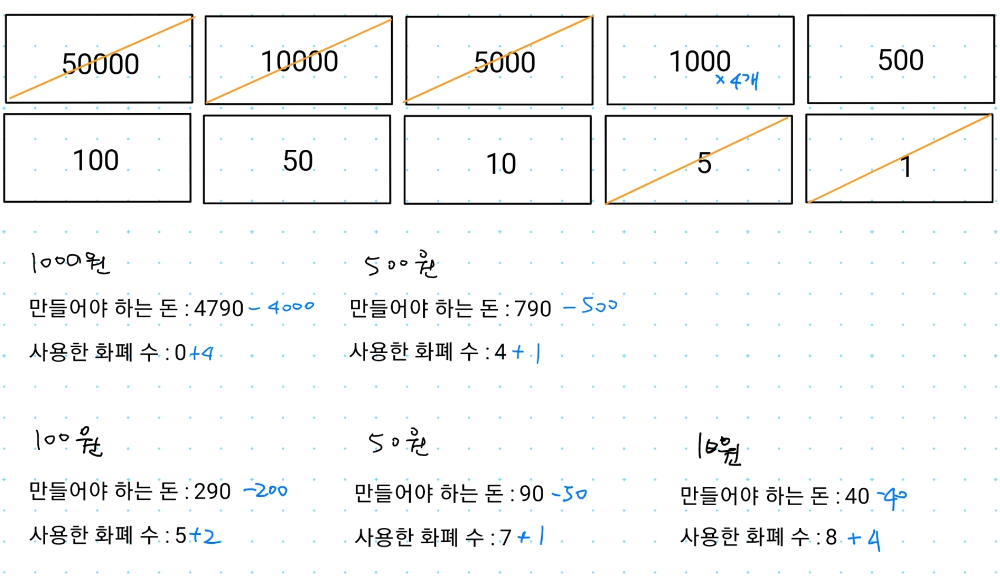

## 1. 11047번: 동전 0

[11047번: 동전 0](https://www.acmicpc.net/problem/11047)

N개의 동전이 주어지면, 적절히 사용해서 최소한의 동전 개수로 K원을 만드는 문제 입니다.

### 문제 해결 아이디어

각 화폐의 단위가 배수 관계이기 때문에 동일한 금액을 줄 수 있는 상황이라면 더 큰 화폐부터 거슬러 주는 것이 중요합니다.

예시 ) 만들어야 하는 돈 : 4790



### 내가 시도한 코드 (정답 판정 ✅)

반복문을 사용해서 화폐 하나 마다 체크해서

1. 남은 돈 에서 화폐를 빼 보아서 0보다 크면 그 화폐는 넘어갑니다.
2. 선택한 화폐를 1개씩 뺄 수 있는 만큼 뺀 후 0보다 작아질 때 까지 뺍니다.
3. 뺄 때 마다 사용한 화폐의 수를 1 더해줍니다.

```tsx
// 1. 11047번: 동전 0
let fs = require("fs");
let input = fs.readFileSync("/dev/stdin").toString().split("\n");
let [n, k] = input[0].split(" ");
let coins = [];
let answer = 0;
for (let i = n; i > 0; i--) {
  coins.push(Number(input[i]));
}

for (let i = 0; i < coins.length; i++) {
  // 예) 4200원 - 50000원 하면 0보다 작으니까 넘어가기
  if (k - coins[i] < 0) continue;
  // 뺄 수 있는 만큼 빼기
  while (true) {
    // 빼다가 0보다 작아지면 그만 빼기
    if (k - coins[i] < 0) break;
    k -= coins[i];
    answer += 1;
  }
}
console.log(answer);
```

### 강사님 정답 코드

화폐 몇 개를 사용하는지랑 남은 금액을 구하는 방법이 제 코드와 달랐습니다.

저는 반복문으로 1개씩 화폐를 뺏지만, 강사님이 제시한 방법은 **(남은 금액 / 화폐)**로 구했습니다.

그리고 거슬러주고 남은 금액은 나머지를 구하는 연산자인 `%` 를 사용해서 구한 점이 달랐습니다.

```tsx
// 1. 11047번: 동전 0
let fs = require("fs");
let input = fs.readFileSync("/dev/stdin").toString().split("\n");
let [n, k] = input[0].split(" ");
let coins = [];
let answer = 0;
for (let i = 1; i <= n; i++) coins.push(Number(input[i]));

for(let i = n - 1; i >= 0; i--) {
  answer += parseInt(k / coins[i]); // 해당 동전을 몇 개 사용해야 하는지
  k %= coins[i]; // 해당 동전으로 모두 거슬러 준 뒤 남은 금액
}
console.log(answer);
```

### 2. 11399번: ATM

[11399번: ATM](https://www.acmicpc.net/problem/11399)

첫 번째 줄에 줄을 선 사람의 수가 주어지고, 두 번째 줄에 줄 선 사람이 돈을 뽑을 때 걸리는 시간이 주어집니다. 이 때 **각 사람이 돈을 인출**하는데 필요한 **시간의 합**의 최솟값을 계산하는 문제 입니다.

**예시 )** `3 1 4 3 2` 순서로 줄 서 있는 경우

3 + 4 + 8 + 11 + 13 = **총 39분** 입니다.

다시 줄을 `1 2 3 3 4` 순서로 줄 세워서 다시 계산 한다면

1 + 3 + 6 + 9 + 13 = **총 32분** 입니다.

### 문제 해결 아이디어

시간이 적게 소요되는 사람부터 처리하면 필요한 시간이 최소로 걸립니다.

따라서 오름차순 정렬 이후에 누적 합을 계산하여 처리 할 수 있습니다.

### 내가 시도한 코드(정답 판정 ✅)

배열의 개수를 1개씩 늘려가며 reduce 메서드를 사용해서 누적 합을 구해보았습니다.

```tsx
// 2. 11399번: ATM
let fs = require("fs");
let input = fs.readFileSync("/dev/stdin").toString().split("\n");
let n = Number(input[0]);
let arr = input[1].split(" ").map(Number);

// 오름차순 정렬 합니다.
arr.sort((a, b) => a - b);

let answer = 0;
// 누적 합을 계산합니다.
for (let i = 0; i < n; i++) {
  answer += arr.slice(0, i + 1).reduce((acc, cur) => acc + cur, 0);
}
console.log(answer);
```

### 강사님 정답 코드

`summary` 에 한 사람 마다 걸린 시간을 더해주고

`answer` 에 모든 사람의 걸린 시간을 더해주는 식으로 문제를 풀면 좀 더 효율 적으로 구할 수 있을 것 같습니다.

```tsx
// 2. 11399번: ATM
let fs = require("fs");
let input = fs.readFileSync("dev/stdin").toString().split("\n");
let n = Number(input[0]);
let arr = input[1].split(" ").map(Number);

arr.sort((a, b) => a - b);

let answer = 0;
let summary = 0;
for (let i = 0; i < n; i++) {
  summary += arr[i]; // 0 + 1, 1 + 2, 3 + 3, 6 + 3, 9 + 4
  answer += summary; // 지금까지 소요된 총 시간을 더합니다. 0 + 1 부터, 1 + 3, 3 + 3, ...
}

console.log(answer);
```

### 3. 1541번: 잃어버린 괄호

[1541번: 잃어버린 괄호](https://www.acmicpc.net/problem/1541)

덧셈과 뺄셈 연산자 만으로 이루어진 수식이 있을 때 괄호를 적절히 넣어 주어 값을 최솟값으로 구하는 문제입니다.

### 문제 해결 아이디어

뺄셈 연산자를 기준으로 최대한 많은 수를 묶어야 더 큰 수를 뺄 수 있습니다. 그렇기 때문에 + 연산자를 기준으로 괄호를 넣는 것은 의미가 없습니다.

**예시 1 )** `10+20+30+40` 마이너스가 없으므로 처리할 것은 없습니다.

**예시 2 )** `55 - 50+40` ⇒ `55 - (50+40)` 마이너스를 기준으로 묶습니다.

**예시 3 )** `90+30 - 20+50 - 30+60 - 70+30+20` ⇒ `(90+30) - (20+50) - (30+60) - (70+30+20)` 마이너스 기준으로 최대한 많이 묶습니다.

### 내가 시도한 방법(실패 ❌)

`+`, `-` 를 기준으로 숫자랑 연산자를 나누어 계산 해보려 했는데, 어떤식으로 코드를 짜야 할 지 모르겠어서 결국 풀지 못했습니다.

```tsx
// 3. 1541번: 잃어버린 괄호
let fs = require("fs");
let input = fs.readFileSync("dev/stdin").toString().split("\n");
let numbers = input[0].split(/[^0-9]/).map(Number);
let operators = input[0].match(/\+|\-/g);

let answer = 0;

console.log(numbers);
console.log(operators);
```

### 강사님 정답 코드

마이너스 연산자를 기준으로 묶어야 풀 수 있는 문제 이기 때문에

1. `split` 메서드를 사용해서 `-`를 기준으로 배열로 만듭니다.
그러면 `+`연산자끼리 괄호로 묶는다고 볼 수 있습니다.
2. +로 묶인 그룹 끼리는 다 더해줍니다.
3. 첫번째로 들어온 그룹은 일단 결과값에 더하고
나머지인 1번 이후는 결과값에서 그룹끼리 연산한 값을 빼줍니다.

```tsx
// 3. 1541번: 잃어버린 괄호
let fs = require("fs");
let input = fs.readFileSync("/dev/stdin").toString().split("\n");
// 주어진 값 55-50+40 일때
// 1. '-' 연산자를 기준으로 +기호로 묶인 요소들 끼리 배열로 만들어줍니다. [ '55', '50+40' ]
let groups = input[0].split("-");
let answer = 0;
for (let i = 0; i < groups.length; i++) {
  // 2. +로 묶인 그룹끼리는 +연산자를 기준으로 나누어서 다 더해줍니다.
  let cur = groups[i].split("+").map(Number).reduce((acc, cur) => acc + cur);
  // 3-1. 첫번째로 들어온 그룹은 일단 결과값에 더하기 (answer = 55)
  if (i == 0) answer += cur;
  // 3-2. 두 번째 그룹 부터는 결과값에서 빼기 (answer = 55 - 90)
  else answer -= cur;
}
console.log(answer); // 결과값 -35
```