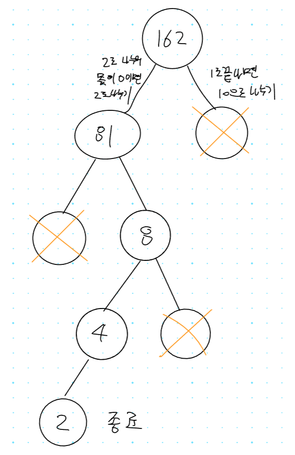
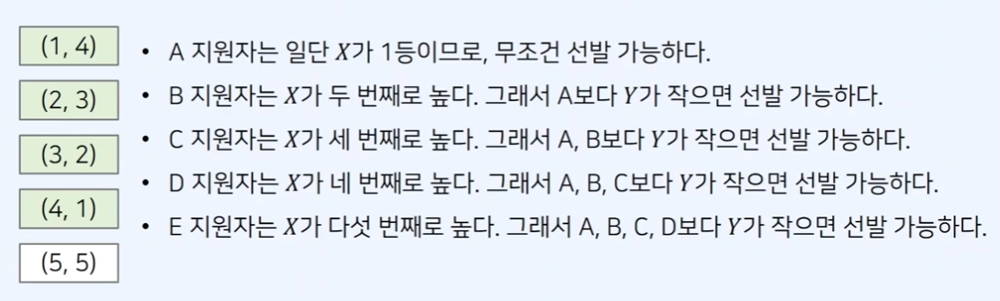
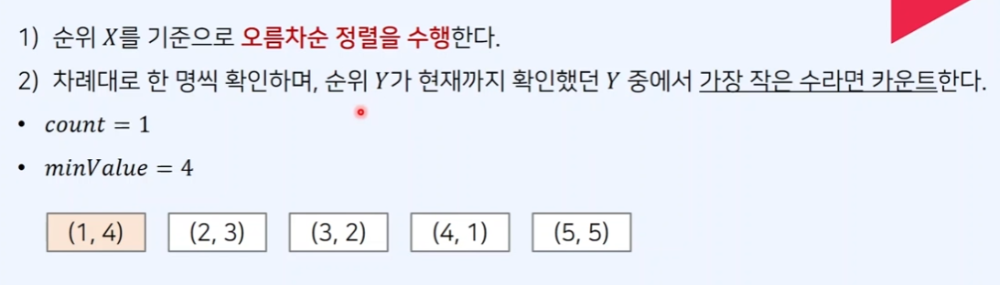

## 1. 2839번: 설탕 배달

[2839번: 설탕 배달](https://www.acmicpc.net/problem/2839)

3kg 봉지, 5kg 봉지 가 있을 때, *N* kg의 설탕을 배달해야 한다면 배달하는 봉지의 최소 개수를 구하는 문제 입니다.

**예시 )** 3kg * 6개를 가져가도 되지만 **5kg * 3, 3kg * 1개**를 가져가는 것이 문제의 핵심 입니다.

### 문제 해결 아이디어

5를 우선적으로 빼는 것이 더 적은 봉지를 가져가는데 유리 하기 때문에 

어떻게 하면 **5의 배수**를 만들 수 있을지 고민하는 것이 중요한 문제 입니다. 

다르게 말하면 3kg 봉지를 더 적게 쓰는 것이 핵심입니다.

1. 현재 값이 5로 나누어 떨어지는 경우, 5로 나누어줍니다.
2. 그렇지 않다면 기존의 값이 5로 나누어 떨어지는 값이 될 때까지 3을 빼준 뒤에 다시 1로 갑니다.

수학적으로 표시 하자면 `3A + 5B = N` 식 에서 **B가 가장 큰 경우를 찾는 문제 입니다.**

### 내가 시도한 코드 (실패 ❌)

거스름돈 문제처럼 접근하였더니 해결하기 매우 어려웠습니다.

다른 방법으로 천천히 고민 후 시도했어야 하는데, 

실행 결과에서 정답이 나올 듯 안 나와서 바꿀 생각을 못했습니다.

**5의 배수 만큼 먼저 빼고** 나머지의 값을 3으로 빼보려고 시도했으나

약간 잘못된 시도라는 것을 강의 영상을 보고 깨닫게 되었습니다.

```tsx
// 1. 2839번: 설탕 배달
let fs = require("fs");
let input = fs.readFileSync("dev/stdin").toString().split("\n");
let n = Number(input[0]);

let bags = [5, 3];

let answer = 0;
for (let i = 0; i < bags.length; i++) {
  answer += parseInt(n / bags[i]); // 18/5 를 정수로 바꾸면 3이고, 나머지 값은 3
  n %= bags[i];
  if()
}
console.log(answer);
```

### 강사님 정답 코드

3을 반복 적으로 빼면서 **아래 조건들을 검사**합니다.

조건을 만족 했다는 것은 3을 뺄 만큼 다 빼고 5의 배수(혹은 5의 배수가 안 나와서  3의 배수)가 되었다는 것 입니다.

1. `n === 0`이 되었거나 (더 이상 뺄 수 없을 때)
2. `n % 5 === 0` 이 되었는지 (5의 배수 인지)
3. 두 조건을 만족하는 경우 **5로 나눈 몫을 더합니다.**
(`n === 0`일 경우에는 나눈 몫이 0이라서 더해도 상관없습니다.)

그렇지 않다면 **계속해서 3을 빼고** 봉지의 개수도 1개 올려줍니다.

3의 배수도 5의 배수도 찾지 못했다면 -1을 마지막에 반환 합니다.

```tsx
// 1. 2839번: 설탕 배달
let fs = require("fs");
let input = fs.readFileSync("/dev/stdin").toString().split("\n");
let n = Number(input[0]);
let cnt = 0;
let flag = false;

while (n >= 0) {
  // 딱 0으로 떨어지거나 정확하게 떨어지지 않을 때까지 반복합니다.
  // n이 0으로 딱 떨어지거나(5의 배수가 안나와서) 5의 배수일때
  if (n === 0 || n % 5 === 0) {
    // 5kg 봉지를 계산한 결과 만큼 더합니다.
    cnt += parseInt(n / 5);
    console.log(cnt);
    // 결과를 찾았으니 true로 바꾸어 줍니다.
    flag = true;
    break;
  }
  // 계속해서 3을 뺍니다.
  n -= 3;
  // 3kg 봉지도 하나씩 더합니다.
  cnt += 1;
}
if (!flag) {
  // 반복문 종료 후에도 값을 못찾았으니 -1을 출력합니다.
  console.log(-1);
}
```

## 2. 16953번: A -> B

[16953번: A → B](https://www.acmicpc.net/problem/16953)

정수 A를 B로 바꾸려고 한다. 가능한 연산은 다음과 같은 두 가지입니다.

- 2를 곱한다.
- 1을 수의 가장 오른쪽에 추가한다.

A → B 로 바꾸는데 필요한 최소 연산 수를 구하는 문제입니다.

### 문제 해결 아이디어

1. **값이 2로 나누어 떨어지는 경우**는 2를 곱했다고 볼 수 있습니다.
2. **일의 자릿수가 1인 경우**는 10을 곱하고 1을 더했다고 볼 수 있습니다.
3. 두 가지의 경우가 **둘 다 아닌 경우**는 더 이상 **진행할 필요가 없습니다.**



### 내가 시도한 코드 (시간 초과 ❌)

이전 문제랑 비슷하게 풀 수 있을 것 같았습니다.

처음에는 재귀 함수로 2 곱하는 함수, 10곱하고 1더하는 함수를 나누어 작성할까 생각했지만

너무 저에게는 어려운 것 같아서 나누기 하는 것을 생각해보다가 힌트가 필요하여

문제 풀이 아이디어만 듣고 힌트를 얻어 코드를 작성해보았습니다.

그러나 어느 부분에서 시간 초과 인지 모르겠어서 풀지는 못했습니다.

```tsx
// 2. 16953번: A -> B
let fs = require("fs");
let input = fs.readFileSync("dev/stdin").toString().split("\n");
let [a, b] = input[0].split(" ").map(Number);
let answer = 0;
let flag = false;

while (b >= a) {
  answer += 1;
  if (b === a) {
    flag = true;
    break;
  }
  if (b % 2 === 0) {
    // 1. 162 % 2 = 0 -> 8 % 2 = 4
    b = b / 2; // 1. b = 81 -> 3. b = 4
  }
  if ((b - 1) % 10 === 0) {
    // 2. (81 - 1) % 10 = 0
    b = (b - 1) / 10; // 2. b = 8
  }
}
if (flag) {
  console.log(answer + 1);
} else {
  console.log(-1);
}
```

### 강사님 정답 코드

알고 보니 else 에서 break를 해주지 않아서 무한 반복 하기 때문에 틀렸던것같습니다.

대부분의 로직은 비슷하게 흘러가는것같습니다.

```tsx
// 2. 16953번: A -> B
let fs = require("fs");
let input = fs.readFileSync("dev/stdin").toString().split("\n");
let [a, b] = input[0].split(" ").map(Number);
let flag = false;
let result = 1;

while (a <= b) {
  if (b === a) {
    flag = true;
    break;
  }
  if (b % 2 === 0) b = parseInt(b / 2);
  else if (b % 10 === 1) b = parseInt(b / 10);
	// 둘다 아니면 break를 해주어야 하는데 안했더니 시간초과가 떳습니다.
  else break;
  result++;
}
if (flag) console.log(result);
else console.log(-1)
```

## 3. 1789번: 수들의 합

[1789번: 수들의 합](https://www.acmicpc.net/problem/1789)

서로 다른 N개의 자연 수의 합 이 S일때

S를 알고 있다면 자연 수 N개를 최대한 많이 더한다면 몇 개까지 더할 수 있을지 구하는 문제입니다. 즉, 서로 다른 자연 수니까 1, 2, 3, 4, … 이렇게 더해서 S가 나올 때까지 더하고 그 수를 구해주면 될 것 같습니다.

### 문제 해결 아이디어

더 많이 더해야 하니까 작은 수부터 차례대로 더하는 것이 좋습니다.

예시 ) S가 200이면 1, 2, 3, 4, 5,… **19 까지 더하면 190**인데 20을 더해버리면 210이 되어 버리니까

**19를 29로 바꾸어** 더하면 200이 나오게 되어 총 19개의 수를 더하게 됩니다.

### 내가 시도한 코드(정답 판정 ✅)

1+2+3+4+…. 처럼 1씩 커지게 더해야 최대한 많이 더할 수 있어서

1. 최종 합인 `sum` 에 더합니다.
2. 더해야 할 수를 1 올립니다.
3. `while` 로 더한 결과값이 S보다 크지 않다면 1로 돌아가서 반복합니다.

```tsx
// 3. 1789번: 수들의 합
let fs = require("fs");
let input = fs.readFileSync("dev/stdin").toString().split("\n");
let s = Number(input[0]);
// 더할 수의 갯수
let su = 0;
// 더해진 값
let sum = 0;
// s 보다 더해진 값 + 더해져야할 수가 크다면 종료
// 예) 1~19까지 더한 값 190에 20을 더하면 200 보다 크므로 종료
while (sum + su <= s) {
  // 1 + 2, 3+3, 6+4, ...
  sum += su;
  // 다음에 더할 숫자 1씩 올리기
  su++;
}
// 마지막에 19까지 더하고 끝날때 1을 또 더해서 20이 되었으므로 1빼기
console.log(su - 1);
```

### 강사님 정답 코드

제가 작성한 코드 보다 조금 더 간결하게 정리된 코드 이고 로직은 거의 같습니다.

```tsx
// 3. 1789번: 수들의 합
let fs = require("fs");
let input = fs.readFileSync("dev/stdin").toString().split("\n");
let s = Number(input[0]);
let sum = 0;
let current = 0;

while(sum <= s) {
  current += 1;
  sum += current;
}
console.log(current - 1);
```

## 4. 1946번: 신입 사원

[1946번: 신입 사원](https://www.acmicpc.net/problem/1946)

신입 사원을 뽑을 때 서류 성적과 면접 성적 중 적어도 하나가 다른 지원자 보다 떨어지지 않는 자를 구해서 합격하는 사람을 구하는 문제입니다. 

솔직히 문제가 무슨 뜻인지 이해가 안되어서 풀지는 못했습니다..

### 내가 시도한 코드 (실패 ❌)

### 문제 해결 아이디어





### 강사님 정답 코드

```tsx
// 4. 1946번: 신입 사원
let fs = require("fs");
let input = fs.readFileSync("dev/stdin").toString().split("\n");
let cases = Number(input[0]);
let line = 1;

for (let i = 0; i < cases; i++) {
  let n = Number(input[line]);
  let arr = [];
  // 각 케이스의 데이터 넣어주기
  for (let j = line + 1; j <= line + n; j++) {
    let data = input[j].split(" ").map(Number);
    arr.push(data);
  }
  // 1차성적 기준으로 정렬
  arr.sort((a, b) => a[0] - b[0]);

  let count = 0;
  let minValue = 100001;
  for (let [x, y] of arr) {
    // 최소값이면 최소값을 최신화 하고 카운트를 올립니다.
    if (y < minValue) {
      minValue = y;
      count += 1;
    }
  }
  console.log(count);
  line += n + 1;
}
```