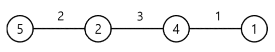
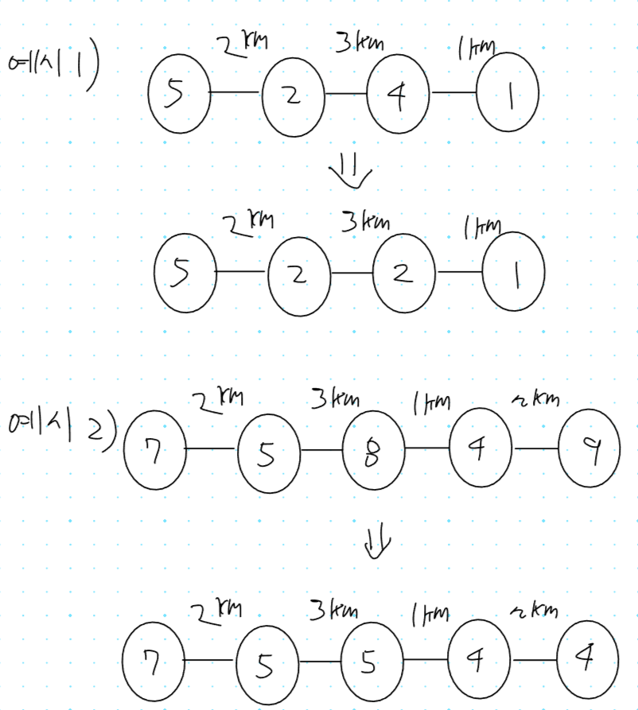
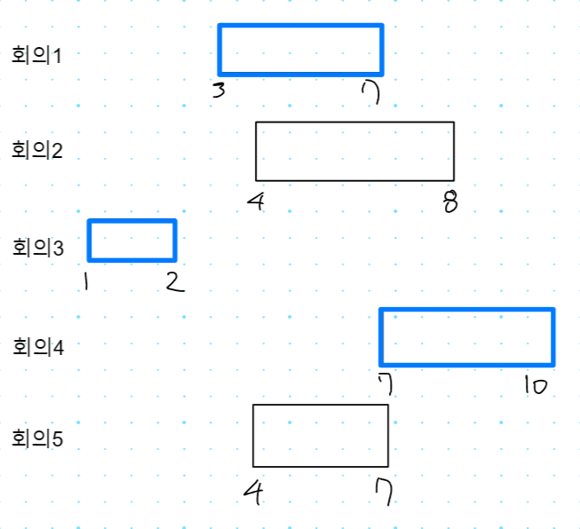
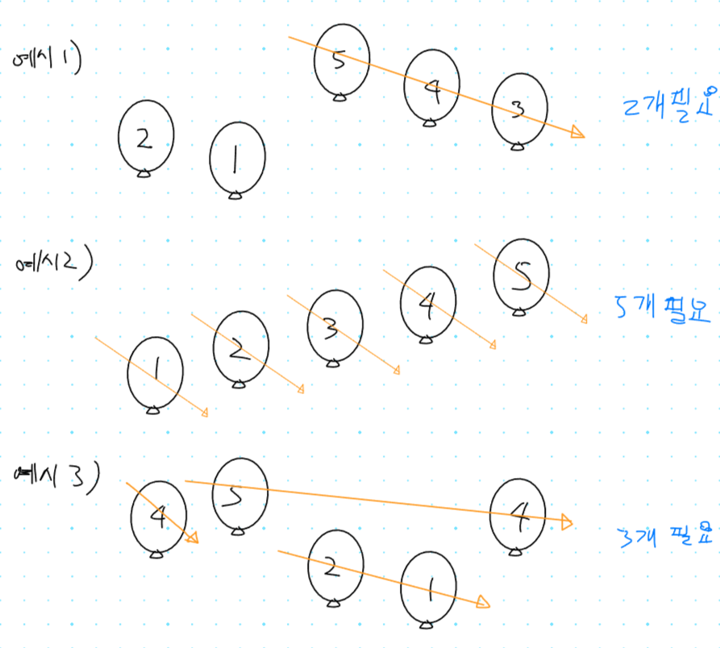
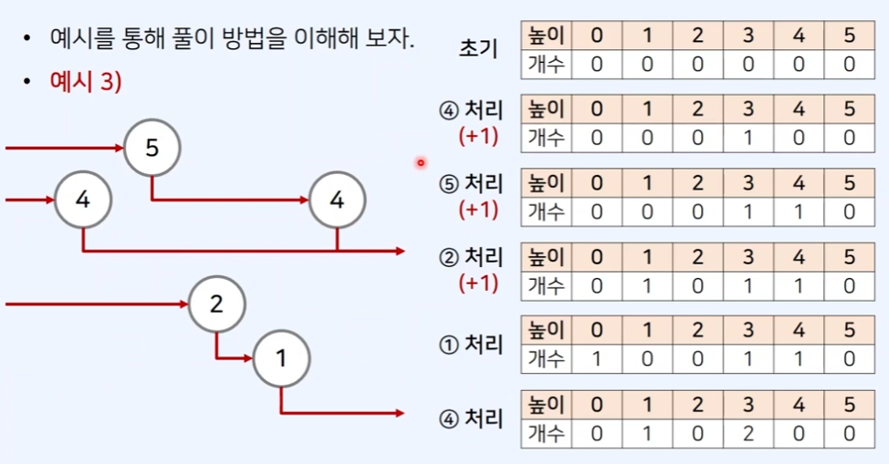

## 1. 13305번: 주유소

[13305번: 주유소](https://www.acmicpc.net/problem/13305)



동그라미 안에 숫자가 **1km당 가격** 이고, 선 위에 숫자는 **가야 할 거리** km입니다.

처음 시작할 때는 기름이 없어서 넣어야 합니다. 왼쪽에서 오른쪽으로 이동할 때 최소의 비용으로 주유하고 싶어 주유 시 최소 값을 구하면 되는 문제입니다.

### 문제 해결 아이디어



### 내가 시도한 코드 (부분 정답 ❌)

저는 1번 예시만 생각하고 코드를 짜서 틀린 것 같습니다. 

1번 예시에선 2가 가장 작기 때문에 단순히 최소 값만 찾아서 주유하는 방식으로 짰습니다.

계속해서 앞이랑 뒤를 비교해가며 최소 값을 바꿔 주어야 하는데, 그러지 못했습니다.

```tsx
// 1. 13305번: 주유소
let fs = require("fs");
let input = fs.readFileSync("/dev/stdin").toString().split("\n");
const n = Number(input[0]);
const distances = input[1].split(" ").map(Number);
const prices = input[2].split(" ").map(Number);
// 마지막 도착지에서는 기름을 넣을 일이 없어서 마지막 요소는 제외하고
// 기름 넣어야 할 지점 중에 가장 싼곳 찾기
let minPrice = Math.min(...prices.slice(0, prices.length - 1));
let result = BigInt(0);
for (i = 0; i < n - 1; i++) {
  // 최소값이라면 거기서 다 주유 합니다.
  if (prices[i] === minPrice) {
    for (j = i; j < n - 1; j++) {
      result += BigInt(distances[j] * prices[i]);
    }
    break;
  }
  // 시작지점에 주유소가 최소값이 아니면 일단 필요한 만큼만 주유합니다.
  if (i === 0) {
    result += BigInt(distances[i] * prices[i]);
  }
}
console.log(String(result));
```

### 강사님 정답 코드

저는 하나의 조건문으로 처리하려다 보니 정답이 나오지 않았는데,

아래의 방법대로 두 개의 반복문을 사용하면 정답 판정을 받을 수 있습니다.

1. 배열의 값을 비오름차순이 되도록 변환 합니다. `[5, 2, 4, 1] => [5, 2, 2, 1]`
2. 도로 당 이동 비용의 합을 계산합니다.

**주의할 점**

**거리는 최대 10,000, 리터 당 가격은 최대 10,000이다.** 이 조건 때문에 BigInt를 써야 하고

답안 제출 할 때는 BigInt 뒤에 붙는 `n`을 없애기 위해 String으로 변환 합니다.

```tsx
let fs = require("fs");
let input = fs.readFileSync("/dev/stdin").toString().split("\n");
const n = Number(input[0]);
const dist = input[1].split(" ").map(Number);
const cost = input[2].split(" ").map(Number);
// 주유 비용(cost) 배열의 값을 비 오름차순이 되도록 변환
// [5, 2, 4, 1] => [5, 2, 2, 1]
let minCost = cost[0];
for (let i = 0; i < n; i++) {
  minCost = Math.min(minCost, cost[i]);
  cost[i] = minCost;
}

// 도로당 이동 비용의 합을 계산 합니다.
let answer = BigInt(0);
for (let i = 0; i < n - 1; i++) {
  answer += BigInt(dist[i]) * BigInt(cost[i]);
}
console.log(String(answer));
```

## 2. 1931번: 회의실 배정

[1931번: 회의실 배정](https://www.acmicpc.net/problem/1931)

한 개의 회의실이 있는데, 겹치지 않게 시간표를 적절히 배분해서 최대한 많은 회의를 진행합니다.

이때, 회의의 최대 개수를 구하는 문제입니다.

### 문제 해결 아이디어

종료 시점이 이른 회의 부터 확인하며, 겹치지 않게 배정합니다.

1. 가장 먼저 모든 회의에 대하여 오름차순 정렬 합니다.
2. 정렬할 때는 1) 종료 시점 2) 시작 시점을 우선순위로 합니다.



### 내가 시도한 코드(정답 인정 ✅)

회의 종료 시간을 기준으로 정렬하고, 종료 시간이 같은 경우는 시작 시간 순으로 정렬 합니다.

그리고 난 다음 최근에 끝난 회의 종료 시간과 시작 시간이 안 겹치면 회의를 확정하는 식으로 진행했습니다.

```jsx
// 2. 1931번: 회의실 배정
let fs = require("fs");
let input = fs.readFileSync("/dev/stdin").toString().split("\n");
let n = Number(input[0]);
let arr = [];

for (let i = 1; i <= n; i++) {
  const array = input[i].split(" ").map(Number);
  arr.push(array);
}
// 회의가 빨리 끝나야 다음 회의가 들어가니까 종료가 빠른 순으로 정렬합니다.
function compareFn(a, b) {
  if (a[1] < b[1]) return -1;
  else if (a[1] > b[1]) return 1;
  else return a[0] - b[0]; // 종료시점이 같으면 시작시점 기준으로 정렬
}
arr.sort(compareFn);

let result = 0;
let endTime = 0;
for (let i = 0; i < arr.length; i++) {
  // 최근에 끝난 회의와 시작 시간이 겹치지 않을 때
  if (endTime <= arr[i][0]) {
    endTime = arr[i][1];
    result += 1;
  }
}
console.log(result);
```

### 강사님 정답 코드

```tsx
// 2. 1931번: 회의실 배정
let fs = require("fs");
let input = fs.readFileSync("/dev/stdin").toString().split("\n");
let n = Number(input[0]);
let arr = [];
for (let i = 1; i <= n; i++) arr.push(input[i].split(" ").map(Number));

arr.sort(function (a, b) {
  if (a[1] != b[1])
    return a[1] - b[1]; // 종료 시점이 다르다면 종료시점 기준 정렬하고
  else return a[0] - b[0]; // 종료시점이 같다면 시작시점 기준으로 정렬
});

let cnt = 1,
  cur = 0; // 첫번째 회의 부터 확인
for (let i = 1; i < n; i++) {
  if (arr[cur][1] <= arr[i][0]) {
    // 현재 회의가 끝난 이후에 회의가 시작되는 경우 카운트
    cur = i;
    cnt += 1;
  }
}

console.log(cnt);
```

## 3. 11509번: 풍선 맞추기

[11509번: 풍선 맞추기](https://www.acmicpc.net/problem/11509)

### 문제 해결 아이디어

해당 높이에 존재하는 화살이 없다면 **화살을 새롭게 사용**합니다.

화살을 하나 날리면 각 높이에 화살이 날아 가고 있습니다. 예를 들어 4에서 화살을 날리면 3번 높이로 쭉~ 날아 가면서 화살을 터트립니다.



그래서 그 위치를 표시하기 위해서 배열을 만들어서 **화살이 몇 번 위치**에 있는지를 **기록**합니다.

만약 반복문을 통해서 풍선 하나하나 검사해서 배열 안에 있는 화살 위치랑 같다면

터트렸다는 거니까 결과에 +1 하고 배열에 저장한 화살의 위치도 -1 해줍니다.



### 내가 시도한 코드(실패 ❌)

우선 처음엔 연속된 숫자를 찾는 것인가 싶었는데, 예시 3을 생각하면 그건 아닌 것 같았습니다.

그래서 혹시 2중 for 문을 통해서 뒤에 있는 풍선들 중에 작은 풍선을 찾아야 하나 싶기도 했습니다.

도통 감이 안 잡혀서 일단 해설 강의 문제 해결 아이디어를 참고해서 문제를 풀어보았습니다.

하지만 이 코드는 90% 넘어서 오답으로 나왔습니다.

```tsx
// 3. 11509번: 풍선 맞추기
let fs = require("fs");
let input = fs.readFileSync("dev/stdin").toString().split("\n");
let n = Number(input[0]);
let balloon = input[1].split(" ").map(Number);
let arrows = new Array(n + 1).fill(0);

for (let i = 0; i < balloon.length; i++) {
  // 화살이 맞았다면 높이를 1 내려 줍니다.
  if (arrows[balloon[i]] > 0) {
    arrows[balloon[i]] -= 1;
    arrows[balloon[i] - 1] += 1;
  } else {
    arrows[balloon[i] - 1] += 1;
  }
}
console.log(arrows.reduce((acc, cur) => acc + cur, 0));
```

### 강사님 정답 코드

제 코드가 틀린 이유는 아마도 배열을 그대로 다 더해서 계산해서 그런 것 같습니다.

거의 비슷한 코드인데 화살을 쏠 때 마다 result에 1을 더해주는 코드가 있으니 정답으로 인정 받는것같습니다.

```tsx
// 3. 11509번: 풍선 맞추기
let fs = require("fs");
let input = fs.readFileSync("/dev/stdin").toString().split("\n");
let n = Number(input[0]);
let balloon = input[1].split(" ").map(Number);
let arrows = new Array(n + 1).fill(0);
let result = 0;
for (let i = 0; i < balloon.length; i++) {
  // 화살이 맞았다면 높이를 1 내려 줍니다.
  if (arrows[balloon[i]] > 0) {
    arrows[balloon[i]] -= 1;
    arrows[balloon[i] - 1] += 1;
  } else {
    arrows[balloon[i] - 1] += 1;
    result += 1;
  }
}
console.log(result);
```

## 4. 9009번: 피보나치

[9009번: 피보나치](https://www.acmicpc.net/problem/9009)

양의 정수가 주어지고, 이를 피보나치 수를 최소한의 개수로 더해서 주어진 수를 만들어내는 문제 입니다.

예시 1) 100이 주어짐 ⇒ 3 + 8 + 89를 더해서 만들 수 있습니다.

### 문제 해결 아이디어

최소한의 개수로 만들어야 하기 때문에 가능한 큰 피보나치 수부터 빼는것이 핵심 아이디어 입니다.

### 내가 시도한 코드(정답 인정 ✅)

솔직히 다시 풀라고 하면 못 풀 것 같지만.. 일단 맞았습니다.

피보나치 수열을 잘 몰라서 구글링을 통해 피보나치 수열 만드는 코드를 조금 검색 해보았고, 그것에 힌트를 얻어서 코드를 구현했습니다.

1. 주어진 값과 근접한 값이 나올때까지 피보나치 수를 만듦니다. 예시) 100보다 크지 않게 `1,2,3,5,8,13,…,89` 까지
2. 만들어진 근접한 값을 주어진 값에서 빼줍니다. 예시 ) `100 - 89`
3. 주어진 값을 빼준 결과값에 다시 넣습니다. 예시 ) `100`을  `11`로 바꾸어 줍니다.
4. 1로 돌아가서 계속 0이 될때까지 반복합니다.

```tsx
// 4. 9009번: 피보나치
let fs = require("fs");
let input = fs.readFileSync("dev/stdin").toString().split("\n");
let n = Number(input[0]);
let arr = [];
for (let i = 1; i <= n; i++) arr.push(Number(input[i]));

for (let i = 0; i < arr.length; i++) {
  let sum = 0;
  let fibo1 = 1;
  let fibo2 = 1;
  const fiboArr = [];
  while (arr[i] >= sum) {
    sum = fibo1 + fibo2;
    fibo1 = fibo2;
    fibo2 = sum;
    // 끝났다면 멈춰주기
    if (arr[i] === 0) break;
    if (arr[i] < sum) {
      // 100 - 1,2,3,5,8,13,...,89 -> 처음 부터 시작해야함..
      // 11 - 1,2,3,5,8,13 -> 또 처음 부터 다시
      // 3 - 1,2,3, 5
      fiboArr.unshift(fibo1);
      arr[i] -= fibo1;
      sum = 0;
      fibo1 = 1;
      fibo2 = 1;
    }
  }
  console.log(fiboArr.join(" "));
}
```

### 강사님 정답 코드

```tsx
// 4. 9009번: 피보나치
let fs = require("fs");
let input = fs.readFileSync("/dev/stdin").toString().split("\n");
const pibo = [0, 1];
while (pibo[pibo.length - 1] < 1e9)
  pibo.push(pibo[pibo.length - 2] + pibo[pibo.length - 1]);

let testCases = Number(input[0]);
for (let tc = 1; tc <= testCases; tc++) {
  let n = Number(input[tc]);
  let result = [];
  let i = pibo.length - 1; // 가장 큰 피보나치 수의 인덱스
  // n이 0이 될 때까지
  while (n > 0) {
    // 가능한 큰 피보나치 수부터 빼기
    if (n >= pibo[i]) {
      n -= pibo[i];
      result.push(pibo[i]);
    }
    i--;
  }
  let answer = "";
  // 오름차순 출력
  for (let i = result.length - 1; i >= 0; i--) answer += result[i] + " ";
  console.log(answer);
}
```