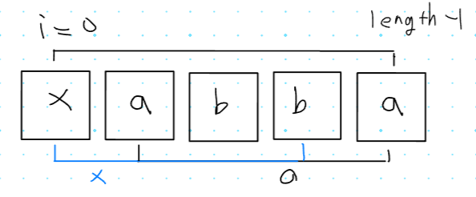

## 1. 19939번: 박 터뜨리기

[19939번: 박 터뜨리기](https://www.acmicpc.net/problem/19939)

N개의 공이 주어지고 K개의 박스가 주어지면

아래와 같은 조건에 맞게 공을 담았을 때 가장 많이 담긴 박스와 적게 담긴 박스의 개수 차이를 구하는 문제 입니다.

1. *N*개의 공을 *K*개의 바구니에 빠짐없이 나누어 담는다.
2. 각 바구니에는 1개 이상의 공이 들어 있어야 한다.
3. 각 바구니에 담긴 공의 개수는 모두 달라야 한다.
4. 가장 많이 담긴 바구니와 가장 적게 담긴 바구니의 공의 개수 차이가 최소가 되어야 한다.

### 문제 해결 아이디어

N이 충분히 공을 나누어 담을 수 있을 만큼 크면 **답은 항상 `K - 1` 혹은 `K`가 나옵니다.**

그렇지 않고 공을 나누어 담기 어려울 정도로 공 **개수가 적으면 `-1`을 출력**하면 됩니다.


### 내가 시도한 코드(실패 ❌)

**문제를 살짝 잘못 이해해서 틀렸습니다.**

저는 k-1이 나올 때가 가장 개수 차이가 최소이니까 그것 만을 가정해서 코드를 작성했습니다.

그래서 무조건 **박스 당 개수 차이가 1개인 것으로 이해**해서 작성하다 보니 실패한 것 같습니다.

```tsx
// 1. 19939번: 박 터뜨리기
let fs = require("fs");
let input = fs.readFileSync("/dev/stdin").toString().split("\n");
let [n, k] = input[0].split(" ").map(Number);

let boxCount = k;

while (n >= k) {
	// 공을 박스 개수만큼 빼줍니다. (박스당 1개씩 나누어 담기)
  n = n - k;
	// 공 넣을 박스 하나 빼기
  k -= 1;
	// 더 뺄 박스가 없을때까지 진행
  if (k === 0) break;
}
// 박스 개수와 공의 개수가 배수이면 정답인 k-1을 출력
if (boxCount % n === 0 || (n === 0 && k === 0)) {
  console.log(boxCount - 1);
} else {
  console.log(-1);
}
```

### 강사님 정답 코드

어쨌든 모든 박스에 개수만 다르면 되기 때문에 개수가 다르게 담을 수 없을 만큼 공의 개수가 적다면 그때만 -1을 출력하게끔, 코드를 작성하신 것 같습니다.

그리고 공의 개수가 충분할 경우, 최소한의 필요한 공의 개수를 빼고 

남은 공들을 박스에 하나씩 더 담는 느낌으로 해서 

만약 박스 개수랑 공 개수가 딱 **맞아떨어지게 공이 남았으면** `k-1` 이 차이 나는 상황이고

**나머지 상황**은 k 개 만큼 차이 나는 상황입니다.

```tsx
// 1. 19939번: 박 터뜨리기
let fs = require("fs");
let input = fs.readFileSync("/dev/stdin").toString().split("\n");
let [n, k] = input[0].split(" ").map(Number);

// 1 부터 k 까지의 합(최소한으로 필요한 공의 개수)
let summary = 0;
for (let i = 1; i <= k; i++) {
  summary += i;
}
if (summary > n) {
  // 최소한 필요한 공의 개수보다 적은 경우
  console.log(-1);
} else {
  // 공의 개수가 충분한 경우
  n -= summary; // 최소한 필요한 공의 개수를 일단 빼고 남은 공을 나눈다.
  // 박스 개수랑 공 개수가 딱 맞아 떨어지면 k-1만큼 차이나는 상황입니다.
  if (n % k == 0) console.log(k - 1);
  else console.log(k); // 그 외에는 K만큼 차이납니다.
}
```

## 2. 17609번: 회문

[17609번: 회문](https://www.acmicpc.net/problem/17609)

level, sos 같이 앞에서 읽어도 거꾸로 읽어도 똑같은 문자열을 회문이라고 합니다.

이때 회문이면 0, 1개 문자만 지우면 회문일 경우 1, 그 외의 경우는 2로 출력하는 프로그램을 작성하는 문제입니다.

### 문제 해결 아이디어

한 문자를 삭제하여 회문으로 만들 수 있는 문자열을 **유사 회문** 이라고 합니다.

문자열의 앞에서부터 한 문자씩 확인하면서 회문이 성립 하는지 확인 합니다.

만약 회문이 성립하지 않는 위치를 찾는다면, 다음의 과정으로 유사회문이 가능한지 여부를 판별합니다.

1. 해당 문자를 지웠을 때 유사회문이 될 수 있는지를 확인 합니다.
2. 대칭된 위치에 있는 문자을 지웠을 때 유사회문이 될 수 있는지를 확인 합니다.

### 내가 시도한 코드(실패 ❌)

어찌어찌 답과 비슷하게 가는듯했으나, 계속해서 출력값이 다른 것이 나와서 결국 포기했습니다.



저는 1번문자=끝문자를 같은지 비교하고, 2번문자=끝에서2번… 순으로 비교하다가

다른문자가 발견되면 앞쪽이 문제인지, 뒷쪽이 문제인지 검사해서 틀린 카운트를 세는 식으로 구현해보았는데, 잘못된 접근 방식이였습니다.

```tsx
// 2. 17609번: 회문
let fs = require("fs");
let input = fs.readFileSync("dev/stdin").toString().split("\n");
let n = Number(input[0]);

for (let tc = 1; tc <= n; tc++) {
  let count = 0;
  const word = input[tc].trim();
  for (let i = 0; i < Math.floor(word.length / 2); i++) {
    if (word.charAt(i) === word.charAt(word.length - i - 1)) continue;
    if (word.charAt(i + 1) !== word.charAt(word.length - i - 1)) {
      count += 1;
    }
    if (word.charAt(i) !== word.charAt(word.length - i - 2)) {
      count += 1;
    }
  }
  console.log(count);
}
```

### 강사님 정답 코드

제가 접근한 방식과 다른 부분은, 먼저 앞쪽을 제거하고 회문 검사를 한번 하고 뒤쪽을 제거하고 다시 회문 검사를 해서 둘 중 어떤 문자가 문제 인지를 체크하는 부분에서 차이가 났던 것 같습니다.

```tsx
// 2. 17609번: 회문
let fs = require("fs");
let input = fs.readFileSync("dev/stdin").toString().split("\n");
// 거꾸로 한 문자도 같은지 확인
function palindrome(x) {
  return x === x.split("").reverse().join("");
}

let textCases = Number(input[0]);
for (let tc = 1; tc <= textCases; tc++) {
  let data = input[tc].trim();
  if (palindrome(data)) console.log(0); // 회문인 경우
  else {
    // 유사회문인지를 검사
    let found = false;
    let n = data.length; // 문자열의 길이
    for (let i = 0; i < parseInt(n / 2); i++) {
      if (data[i] !== data[n - i - 1]) {
        // 대칭이 아닌 문자를 찾은 경우
        if (palindrome(data.slice(0, i) + data.slice(i + 1, n))) found = true; // 앞쪽문자 제거후 회문 검사
        if (palindrome(data.slice(0, n - i - 1) + data.slice(n - i, n)))
          found = true; // 뒤쪽문자 제거후 회문 검사
        break;
      }
    }
    if (found) console.log(1); // 유사 회문인 경우
    else console.log(2); // 회문도 아니고 유사 회문도 아닌경우
  }
}
```

## 3. 1493번: 박스 채우기

[1493번: 박스 채우기](https://www.acmicpc.net/problem/1493)

length x width x height 크기의 박스가 있을때 정육면체 모양의 큐브를 최대한 적게 사용해서 채우는 문제 입니다. 이때 큐브의 크기는 `1 x 1 x 1`, `2 x 2 x 2`, `4 x 4 x 4`,… 이런 식으로 2의 제곱만큼 커집니다.

### 문제 해결 아이디어

박스의 크기가 2의 제곱만큼 커지면 들어갈 수 있는 개수가 8배씩 커집니다.

그래서 넣을 수 있는 최대한 큰 큐브부터 넣는것이 중요한 문제 입니다.


### 내가 시도한 코드(실패 ❌)

### 강사님 정답 코드

```tsx
// 3. 1493번: 박스 채우기
let fs = require("fs");
let input = fs.readFileSync("/dev/stdin").toString().split("\n");
let [length, width, height] = input[0].split(" ").map(Number);
let n = Number(input[1]);
let cubes = new Array(20).fill(0);

for (let i = 2; i <= n + 1; i++) {
  let [a, b] = input[i].split(" ").map(Number);
  cubes[a] = b;
}
// x보다 작거나 같으면서 가장 가까운 2^i를 찾는 함수
function nearestSquare(x) {
  let i = 1;
  while (2 ** i <= x) i += 1;
  return i - 1;
}

// 채울 수 있는 큐브중에 가장 큰 큐브를 찾는 로직
let size = 19;
size = nearestSquare(length);
size = Math.min(size, nearestSquare(width));
size = Math.min(size, nearestSquare(height));

let res = 0;
let used = 0;

// 가장 큰 큐브부터 넣을 수 있는 만큼 넣는 로직들
for (let i = size; i >= 0; i--) {
  used *= 8; // 채널, 너비, 높이가 2씩 줄었으므로 큐브의 개수는 8배 증가
  cur = 2 ** i; // 현재의 정육면체 큐브의 길이
  // 채워넣어야할 큐브의 개수 계산
  let required =
    parseInt(length / cur) * parseInt(width / cur) * parseInt(height / cur) -
    used;
  let usage = Math.min(required, cubes[i]); // 이번 단계에서 넣을 수 있는 큐브의 개수
  res += usage;
  used += usage;
}
if (used === length * width * height) console.log(res); // 박스를 가득 채운 경우
else console.log(-1);
```