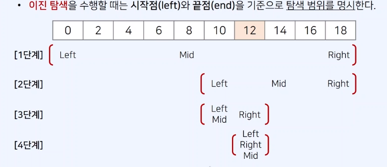

# 이진 탐색 알고리즘 (Binary Search Algorithm)

---

<br>

## 1. 동작 방식

- 시작점(left)와 끝점(end)을 기준으로 탐색 범위를 명시
  

## 2. 시간 복잡도

- 각 단계마다 탐색 범위를 2로 나누는 것으로 이해할 수 있다.
- 이상적인 경우 매 단계마다 범위가 반으로 감소, 로그(log) 복잡도를 가진다.

## 3. 대표적인 사용법

- 매우 넓은 범위(억 단위 이상)에서 최적의 해를 찾아야 하는 경우
- 데이터를 정렬한 뒤에 다수의 쿼리를 날려야 하는 경우

## 4. 코드 예시 (재귀 함수)

```js
// 재귀함수 소스코드 구현
function binarySearch(arr, target, start, end) {
  if (start > end) return -1; //없음
  let mid = parseInt((start + end) / 2);
  // 찾은 경우 중간점 인덱스 반환
  if (arr[mid] == target) return mid;
  //중간 점 > 찾는 값  일 때 왼쪽 확인
  else if (arr[mid] > target) return binarySearch(arr, target, start, mid - 1);
  // 중간 점 < 찾는 값  일 때 오른쪽 확인
  else return binarySearch(arr, target, mid + 1, end);
}

//n(원소의 개수)와 target(찾는 값)
let n = 10;
let target = 7;
arr = [1, 3, 5, 7, 9, 11, 13, 15, 17, 19];

// 이진 탐색 수행 결과 출력
let result = binarySearch(arr, target, 0, n - 1); //결과는 찾은 값의 인덱스
if (result == -1) console.log("원소가 존재하지 않습니다.");
else console.log(`${result + 1}번째 원소입니다.`);
```

## 5. 코드 예시 (반복문)

```js
// 반복문 소스코드 구현
function binarySearch(arr, target, start, end) {
  while (start <= end) {
    let mid = parseInt((start + end) / 2);
    // 찾은 경우 중간점 인덱스 반환
    if (arr[mid] == target) return mid;
    //중간 점 > 찾는 값  일 때 왼쪽 확인
    else if (arr[mid] > target) end = mid - 1;
    // 중간 점 < 찾는 값  일 때 오른쪽 확인
    else start = mid + 1;
  }
  return -1;
}

//n(원소의 개수)와 target(찾는 값)
let n = 10;
let target = 7;
arr = [1, 3, 5, 7, 9, 11, 13, 15, 17, 19];

// 이진 탐색 수행 결과 출력
let result = binarySearch(arr, target, 0, n - 1); //결과는 찾은 값의 인덱스
if (result == -1) console.log("원소가 존재하지 않습니다.");
else console.log(`${result + 1}번째 원소입니다.`);
```
