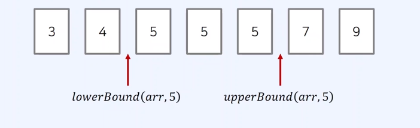

# lowerBound() & upperBound()

---

<br>

## 1. 정렬된 배열에서 특정 원소의 개수 구하기

- 코딩 테스트에서는 정렬된 배열에서 값이 특정 범위에 해당하는 원소의 개수를 계산하는 것을 종종 요구
- 이러한 문제를 해결하기 위해 `lowerBound()`함수와 `upperBound()` 함수를 사용할 수 있다.

## 2. 하한선과 상한선 함수

- lowerBound(arr, x) : 정렬된 순서를 유지하면서 배열 arr에 x를 넣을 가장 왼쪽 인덱스를 반환
- upperBound(arr, x) : 정렬된 순서를 유지하면서 배열 arr에 x를 넣을 가장 오른쪽 인덱스를 반환
  

## 3. `lowerBound()` 코드 예시

```js
// 정렬된 순서를 유지하면서 배열에 삽일 할 가장 왼쪽 인덱스를 반환
function lowerBound(arr, target, start, end) {
  while (start < end) {
    let mid = parseInt((start + end) / 2);
    if (arr[mid] >= target) end = mid; //최대한 왼쪽으로 이동하기
    else start = mid + 1;
  }
  return end;
}
```


## 4. `upperBound()` 코드 예시

```js
// 정렬된 순서를 유지하면서 배열에 삽일 할 가장 오른쪽 인덱스를 반환
function upperBound(arr, target, start, end) {
  while (start < end) {
    let mid = parseInt((start + end) / 2);
    if (arr[mid] > target) end = mid;
    else start = mid + 1; //최대한 오른쪽으로 이동하기
  }
  return end;
}
```

## 5. countByRange()

- 정렬된 배열에서 값이 특정 범위에 속하는 원소의 개수를 계산
- 앞서 정의한 lowerBound() 함수와 upperBound() 함수를 이용해 구현할 수 있다.

```js
// 값이 [leftValue, rightValue]인 데이터의 개수를 반환하는 함수
function countByRange(arr, leftValue, rightValue) {
  // 유의 : lowerBound와 upperBound는 end의 변수의 값을 배열의 길이로 설정
  let rightIndex = upperBound(arr, rightValue, 0, arr.length);
  let leftIndex = lowerBound(arr, leftValue, 0, arr.length);
  return rightIndex - leftIndex;
}

// 배열 선언
let arr = [1, 2, 3, 3, 3, 3, 4, 4, 8, 9];
//값이 4인 데이터 개수 출력
console.log(countByRange(arr, 4, 4));
// 값이 [-1, 3] 범위에 있는 데이터 개수 출력
console.log(countByRange(arr, -1, 3));
```
