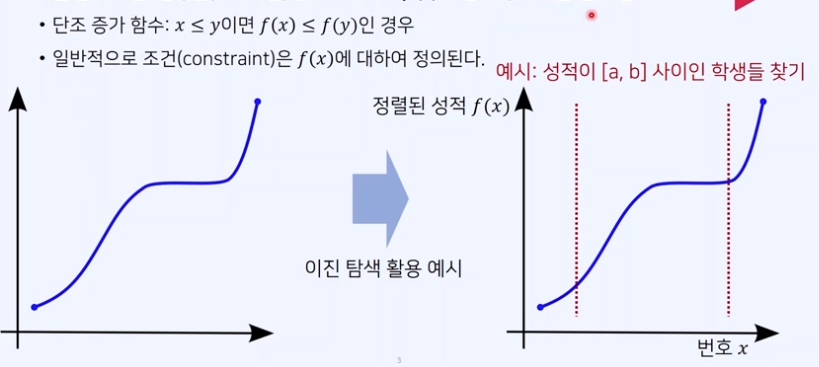
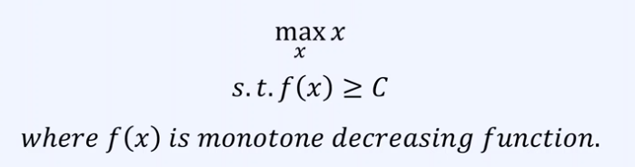
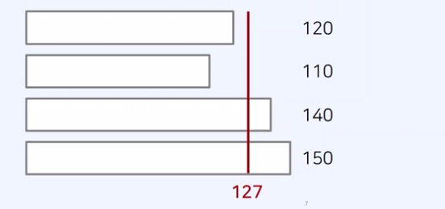

# 파라메트릭 서치(Parametric Search)

---

<br>

## 1. 이진 탐색 조건

변경할(최적화 할) 값 x에 대하여 f(x)가 단조 증가 혹은 단조 감소

- 단조 증가 함수 : x ≤ y 이면 f(x) ≤ f(y)인 경우
  일반적으로 조건(constraint)은 f(x)에 대하여 정의된다.
  

## 2. 파라메트릭 서치(Parametric Search)

- 최적화 문제를 결정 문제('예' 혹은 '아니오')로 바꾸어 해결하는 기법이다.
  예시 : 특정한 조건을 만족하는 가장 알맞은 값을 빠르게 찾는 최적화 문제
- 일반적으로 코딩 테스트에서 파라메트릭 서치 문제는 이진 탐색을 이용하여 해결할 수 있다.
  파라메트릭 서치 문제의 목적 함수 예시 :
  

## 3. 예산 문제

https://www.acmicpc.net/problem/2512

### 강의에서 제시한 문제 해결 아이디어

- 문제 요구사항 : 적절한 상한 금액을 찾는 것이 문제의 목표
- 전체 국가 예산이 485이고, 4개의 지방 예산 요청이 120, 110, 140,150이라고 하자
  -> 상한 금액이 127인 경우, 배정 금액의 합이 120 + 110 + 127 + 127 = 484 이다.
  

1. 배정된 총 예산이 조건을 만족 -> 상한금액을 증가(최대화가 목표)
2. 배정된 총 예산이 조건을 만족 X -> 상한 금액을 감소

### 정답 예시 (파라메트릭 서치의 전형적인 코드 예시)

```js
let fs = require("fs");
let input = fs.readFileSync("dev/stdin").toString().split("\n");

let n = Number(input[0].split(" ")[0]); //지방의 갯수
let arr = input[1].split(" ").map(Number); // 지방의 예산요청
let m = Number(input[2]); // 총 예산

// 이진 탐색을 위한 시작점(start)과 끝점(end) 설정
let start = 1;
let end = arr.reduce((a, b) => Math.max(a, b));

let result = 0;
// 이진 탐색 수행(반복문)
while (start <= end) {
  let mid = parseInt((start + end) / 2);
  let total = 0; // 배정된 예산의 총액 계산
  for (x of arr) {
    // 각 지방에서 요청한 예산을 하나씩 확인하며
    total += Math.min(mid, x); // 예산 배정
  }
  if (total <= m) {
    // 조건 만족 -> 상한액 증가
    result = mid;
    start = mid + 1;
  } else {
    // 조건 만족 X -> 상한액 감소
    end = mid - 1;
  }
}
console.log(result);
```
