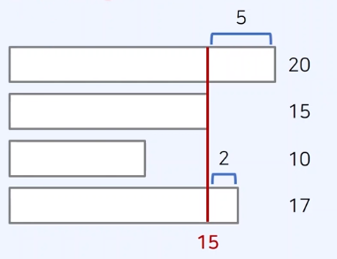

## 1. 예산

https://www.acmicpc.net/problem/2512

### 강의에서 제시한 문제 해결 아이디어

- 문제 요구사항 : 적절한 상한 금액을 찾는 것이 문제의 목표
- 전체 국가 예산이 485이고, 4개의 지방 예산 요청이 120, 110, 140,150이라고 하자
  -> 상한 금액이 127인 경우, 배정 금액의 합이 120 + 110 + 127 + 127 = 484 이다.
  

1. 배정된 총 예산이 조건을 만족 -> 상한금액을 증가(최대화가 목표)
2. 배정된 총 예산이 조건을 만족 X -> 상한 금액을 감소

### 정답 예시

```js
let fs = require("fs");
let input = fs.readFileSync("dev/stdin").toString().split("\n");

let n = Number(input[0].split(" ")[0]); //지방의 갯수
let arr = input[1].split(" ").map(Number); // 지방의 예산요청
let m = Number(input[2]); // 총 예산

// 이진 탐색을 위한 시작점(start)과 끝점(end) 설정
let start = 1;
let end = arr.reduce((a, b) => Math.max(a, b));

let result = 0;
// 이진 탐색 수행(반복문)
while (start <= end) {
  let mid = parseInt((start + end) / 2);
  let total = 0; // 배정된 예산의 총액 계산
  for (x of arr) {
    // 각 지방에서 요청한 예산을 하나씩 확인하며
    total += Math.min(mid, x); // 예산 배정
  }
  if (total <= m) {
    // 조건 만족 -> 상한액 증가
    result = mid;
    start = mid + 1;
  } else {
    // 조건 만족 X -> 상한액 감소
    end = mid - 1;
  }
}
console.log(result);
```

<br>

## 2. 나무 자르기

https://www.acmicpc.net/problem/2805

### 강의에서 제시한 문제 해결 아이디어

- 문제의 목표 : 적절한 높이(height) 값 찾기
- 높이를 15로 설정한 경우 총 7만큼의 나무를 얻을 수 있다
  

1. 절단기의 높이가 올라가는 경우 : 얻을 수 있는 나무의 양 감소
2. 절단기의 높이가 내려가는 경우 : 나무의 양 증가

### 제출 답안

x -오답 : 코드는 1번과 거의 유사했는데 1번에서 변형을 어떻게 해야할지 몰랐다.

### 정답 예시

```js
let fs = require("fs");
let input = fs.readFileSync("dev/stdin").toString().split("\n");

// 나무의 수(n), 가져갈 나무 길이(m)
let [n, m] = input[0].split(" ").map(Number);
let arr = input[1].split(" ").map(Number); // 각 나무 높이

// 이진 탐색을 위한 시작점(start)과 끝점(end) 설정
let start = 0;
let end = arr.reduce((a, b) => Math.max(a, b));

let result = 0;
// 이진 탐색 수행(반복문)
while (start <= end) {
  let mid = parseInt((start + end) / 2);
  let total = 0; // mid로 잘랐을 때 얻을 수 있는 나무의 양 계산
  for (x of arr) if (x > mid) total += x - mid;
  if (total < m)
    end = mid - 1; // 나무의 양이 부족한 경우 더 많이 자르기 (높이 내리기)
  else {
    // 나무의 양이 충분한 경우 덜 자르기(높이 올리기)
    result = mid; // 최대한 덜 잘랐을 때가 정답이므로 result에 기록
    start = mid + 1;
  }
}
console.log(result);
```

<br>

## 3. 랜선 자르기

https://www.acmicpc.net/problem/1654

### 강의에서 제시한 문제 해결 아이디어

- 요구사항 : 랜선의 개수 N개 이상을 얻을 수 있는 길이의 최댓값

1. 길이를 키우면, 얻을 수 있는 랜선의 수 감소
2. 길이를 줄이면, 얻을 수 있는 랜선의 수 증가

### 제출 답안

```js
let fs = require("fs");
let input = fs.readFileSync("dev/stdin").toString().split("\n");

// 가지고 있는 개수(k), 필요한 개수(n)
let [k, n] = input[0].split(" ").map(Number);
let arr = [];
for (let i = 1; i <= k; i++) arr.push(Number(input[i]));

let start = 1;
let end = arr.reduce((a, b) => Math.max(a, b));

let result = 0;
while (start <= end) {
  let mid = parseInt((start + end) / 2);
  let total = 0; // 총 잘린 갯수
  for (x of arr) if (x > mid) total += parseInt(x / mid); //자른 갯수 확인
  if (total < n) end = mid - 1; // 갯수 부족하면 mid 줄이기
  else {
    result = mid;
    start = mid + 1;
  }
}
console.log(result);
```

-오답 : 결과값은 200으로 나오지만 오답
for 문 이후 ` if (x > mid)` 불필요

### 정답 예시

```js
let fs = require("fs");
let input = fs.readFileSync("dev/stdin").toString().split("\n");

// 가지고 있는 개수(k), 필요한 개수(n)
let k = Number(input[0].split(" ")[0]);
let n = Number(input[0].split(" ")[1]);
let arr = [];
for (let i = 1; i <= k; i++) arr.push(Number(input[i]));

let start = 1;
let end = arr.reduce((a, b) => Math.max(a, b));

let result = 0;
while (start <= end) {
  let mid = parseInt((start + end) / 2);
  let total = 0;
  for (x of arr) total += parseInt(x / mid);
  if (total < n) end = mid - 1;
  else {
    result = mid;
    start = mid + 1;
  }
}
console.log(result);
```
