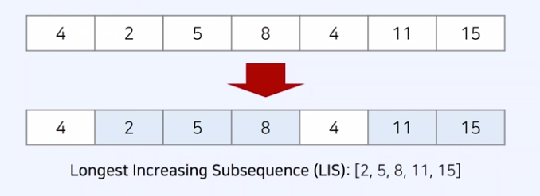
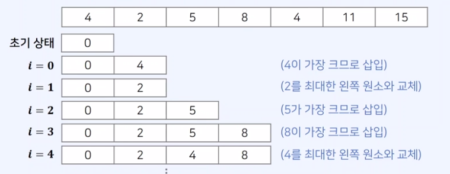

## 1. 숫자 카드 2

https://www.acmicpc.net/problem/10816

### 강의에서 제시한 문제 해결 아이디어

- 이진 탐색을 위해 데이터를 오름차순 정렬
- lowerBound()와 upperBound() 이해
- countByRange()를 사용

### 제출 답안

```js
let fs = require("fs");
let input = fs.readFileSync("dev/stdin").toString().split("\n");

let n = Number(input[0]); //가지고 있는 개수
let numberArray = input[1].split(" ").map(Number); // 카드에 적힌 숫자 배열
let m = Number(input[2]); //쿼리 수
let queryArray = input[3].split(" ").map(Number); // 갯수 구해야할 배열

numberArray.sort((a, b) => a - b);

result = "";
for (x of queryArray) {
  let cnt = countByRange(numberArray, x, x);
  result += cnt + " ";
}

console.log(result);

//함수들
function lowerBound(arr, target, start, end) {
  while (start < end) {
    let mid = parseInt((start + end) / 2);
    if (arr[mid] >= target) end = mid;
    else start = mid + 1;
  }
  return end;
}
function upperBound(arr, target, start, end) {
  while (start < end) {
    let mid = parseInt((start + end) / 2);
    if (arr[mid] > target) end = mid;
    else start = mid + 1;
  }
  return end;
}
function countByRange(arr, leftValue, rightValue) {
  let rightIndex = upperBound(arr, rightValue, 0, arr.length);
  let leftIndex = lowerBound(arr, leftValue, 0, arr.length);
  return rightIndex - leftIndex;
}
```

- 정답!
  정답 예시와 다른 점은 `for of`를 사용한 것

### 정답 예시

```js
let fs = require("fs");
let input = fs.readFileSync("dev/stdin").toString().split("\n");

let n = Number(input[0]);
let arr = input[1].split(" ").map(Number);
let m = Number(input[2]);
let query = input[3].split(" ").map(Number);

arr.sort((a, b) => a - b);

answer = "";
for (let i = 0; i < m; i++) {
  let cnt = countByRange(arr, query[i], query[i]);
  answer += cnt + " ";
}
console.log(answer);

//함수 생략
```

<br>

## 2. 병사 배치하기

https://www.acmicpc.net/problem/18353

### 강의에서 제시한 문제 해결 아이디어

- 요구사항 : 전투력이 높은 병사가 앞쪽에 오도록 내림차순 정렬
  1. 배치과정에서는 특정 위치의 병사를 열외시키는 방법 사용
  2. 남은 병사의 수가 최대가 되도록 하는 것이 목표

✨ 특정한 수열에서 **"가장 긴 증가하는 부분 수열"**을 찾는 문제

- Long Increasing Subsequence(LIS) 알고리즘
- 부분 수열 : 주어진 수열의 일부 항을 원래 순서대로 나열하여 얻을 수 있는 수열
  

- 아이디어 : 현재 원소가 가장 크다면 뒤에 삽입하고, 그렇지 않다면 최대한 왼쪽의 원소와 교체
  

### 제출 답안

```js
let fs = require("fs");
let input = fs.readFileSync("dev/stdin").toString().split("\n");

let n = Number(input[0]); //병사 수
let arr = input[1].split(" ").map(Number); // 병사 별 전투력

let cnt = [];
for (let i = 0; i < n; i++) {
  let a = arr[i];
  let b = arr[i + 1];
  if (a < b) cnt.push(b);
}

console.log(cnt.length);
```

-오답 : 출력된 숫자는 동일하지만 강의에서 제시한 형식을 사용하지 않았다.

### 정답 예시

```js
let fs = require("fs");
let input = fs.readFileSync("dev/stdin").toString().split("\n");

let n = Number(input[0]); //병사 수
let arr = input[1].split(" ").map(Number); // 병사 별 전투력

arr.reverse(); // 순서를 뒤집어 최장 증가 부분 수열(LIS)문제로 변환

let d = [0]; // LIS배열
// 이진 탐색을 활용한 LIS 알고리즘 수행
for (x of arr) {
  if (d[d.length - 1] < x) {
    //마지막 원소보다 현재 원소 x가 크다면 가장 뒤에 넣기
    d.push(x);
  } else {
    //  x 이하인 원소가 있다면 가능한 왼쪽에 있는 원소와 x를 교체
    let index = lowerBound(d, x, 0, d.length);
    d[index] = x;
  }
}
console.log(n - (d.length - 1));
```

<br>

## 3. K번째 수

https://www.acmicpc.net/problem/1300

### 강의에서 제시한 문제 해결 아이디어

- "현재 mid보다 작거나 같은 데이터의 수가 K개 이상이 되는 조건"을 만족하는 mid중에서 가장 작을 값을 구하기
- 파라메트릭 서치 문제로 볼 수 있음

### 제출 답안

```js
let fs = require("fs");
let input = fs.readFileSync("dev/stdin").toString().split("\n");

let n = Number(input[0]);
let k = Number(input[1]);

let arr = [];
for (let i = 1; i <= n; i++) {
  for (let j = 1; j <= n; j++) arr.push(i * j);
}

let start = 1;
let end = n ** n;

let result = 0;
while (start <= end) {
  let mid = parseInt((start + end) / 2);
  let total = 0;
  for (x of arr)
    if (mid <= x) {
    }
}
```

-오답 : 미제출 - for문으로 arr부터 만들고 정렬하려 했는데 잘못된 방법인 걸 깨달았다. 시간초과.

### 정답 예시

```js
let fs = require("fs");
let input = fs.readFileSync("dev/stdin").toString().split("\n");

let n = Number(input[0]); // 배열의 크기
let k = Number(input[1]); // 인덱스 k

let start = 1; // 배열에 존재할 수있는 가장 작은 값
let end = 10 ** 10; // 배열에 존재할 수 있는 가장 큰 값

let result = 0;
while (start <= end) {
  //이진 탐색 수행(반복적)
  let mid = parseInt((start + end) / 2); //현재의 중간점
  let total = 0; // mid보다 작거나 같은 데이터의 개수
  for (let i = 1; i <= n; i++) {
    total += Math.min(parseInt(mid / i), n);
  }
  if (total >= k) {
    //mid보다 작거나 같은 데이터의 개수 >= k
    result = mid; // result에 기록
    end = mid - 1; //탐색범위 왼쪽으로 이동
  }
  // mid보다 작거나 같은 데이터의 개수 < k
  else start = mid + 1;
}
console.log(result);
```
