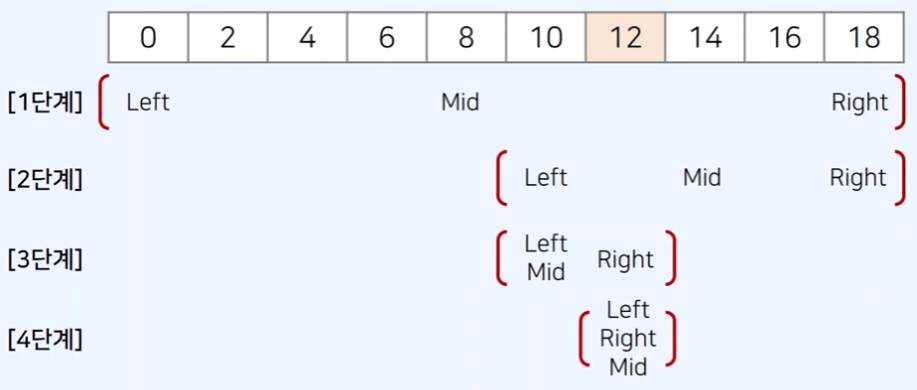

## 순차 탐색 vs 이진 탐색

순차 탐색은 앞에서부터 하나씩 확인하는 것이며 시간 복잡도는 *O(N)* 입니다.

이진 탐색은 정렬이 되어있는 리스트에서 탐색 범위를 절반씩 좁혀가며 데이터를 탐색합니다.

## 이진 탐색의 동작 방식

**시작점(left)**와 **끝점(end)**을 기준으로 탐색범위를 명시합니다.



**1단계**

`[0 ~ 18]` 중간에 있는 `8`과 찾아야 할 `12`를 비교해서 어떤 값이 더 큰지에 따라

앞에서부터 찾을지, 뒤에서부터 찾을지를 결정합니다.

8보다는 12가 크기 때문에 뒤쪽에 12가 있다고 판단되니

검색할 **시작점(left)을 mid 뒤로** 바꾸어 줍니다.

**2단계**

`[10 ~ 18]` 중간에 있는 `14`와 찾아야 할 `12`를 비교해보니 14가 더 크기 때문에

이번에는 **끝점(right)을 mid 앞으로** 옮겨줍니다.

**3단계**

`[10 ~ 12]` 는 요소가 2개만 있어서 left와 mid가 동일해져서 mid가 `10`입니다.

이 경우는 **시작점(left)을 mid 뒤로** 옮겨줍니다.

**4단계**

mid 위치에 있는 12를 찾았습니다.

### 이진 탐색 코드 예시 (재귀 함수)

```tsx
// 이진 탐색 소스코드 구현(재귀 함수)
function binarySearch(arr, target, start, end) {
  if (start > end) return -1;
  let mid = parseInt((start + end) / 2);
  // 찾은 경우 중간점 인덱스 반환
  if (arr[mid] === target) return mid;
  // 중간점의 값보다 찾고자 하는 값이 작은 경우 왼쪽 확인
  else if (arr[mid] > target) return binarySearch(arr, target, start, mid - 1);
  // 중간점의 값보다 찾고자 하는 값이 작은 경우 오른쪽 확인
  else return binarySearch(arr, target, mid + 1, end);
}

// n(원소의 개수)와 target(찾고자 하는 값)
let n = 10;
let target = 7;
const arr = [1, 3, 5, 7, 9, 11, 13, 15, 17, 19];

// 이진 탐색 수행 결과 출력
let result = binarySearch(arr, target, 0, n - 1);
if (result == -1) console.log("원소가 존재하지 않습니다.");
else console.log(`${result + 1}번째 원소입니다.`);
```

### 이진 탐색 코드 예시 (반복문)

```tsx
function binarySearch(arr, target, start, end) {
  while (start <= end) {
    let mid = parseInt((start + end) / 2);
    // 찾은 경우 중간점 인덱스 반환
    if (arr[mid] === target) return mid;
    // 중간점의 값보다 찾고자 하는 값이 작은 경우 왼쪽 확인
    else if (arr[mid] > target) end = mid - 1;
    else start = mid + 1;
  }
  return -1;
}

// n(원소의 개수)와 target(찾고자 하는 값)
let n = 10;
let target = 7;
const arr = [1, 3, 5, 7, 9, 11, 13, 15, 17, 19];

// 이진 탐색 수행 결과 출력
let result = binarySearch(arr, target, 0, n - 1);
if (result == -1) console.log("원소가 존재하지 않습니다.");
else console.log(`${result + 1}번째 원소입니다.`);
```