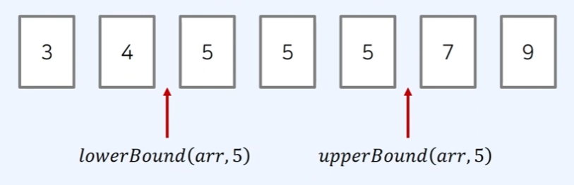

## 정렬된 배열에서 특정 원소의 개수 구하기

값이 특정 범위에 속하는 원소의 개수 구하려면, 이진 탐색 함수가 제공(js외의 다른 언어에서는 제공합니다)하는 2가지 기능을 이해할 필요가 있습니다.

**lowerBound(arr, x) -** 정렬된 순서를 유지하면서 배열 `arr`에 `x`를 넣을 **가장 왼쪽** 인덱스를 반환

**upperBound(arr, x) -** 정렬된 순서를 유지하면서 배열 `arr`에 `x`를 넣을 **가장 오른쪽** 인덱스를 반환



특정 원소의 개수를 구하고 싶다면 `lowerBound - upperBound` 계산해서 구할 수 있습니다.

### lowerBound, upperBound js에서 구현하기

```tsx
// 정렬된 순서를 유지하면서 배열에 삽입할 가장 왼쪽 인덱스 반환
function lowerBound(arr, target, start, end) {
  while (start < end) {
    let mid = parseInt((start + end) / 2);
    if (arr[mid] >= target) end = mid; // 최대한 왼쪽으로 이동하기
    else start = mid + 1;
  }
  return end;
}

// 정렬된 순서를 유지하면서 배열에 삽입할 가장 오른쪽 인덱스 반환
function upperBound(arr, target, start, end) {
  while (start < end) {
    let mid = parseInt((start + end) / 2);
    if (arr[mid] > target) end = mid;
    else start = mid + 1; // 최대한 오른쪽으로 이동하기
  }
  return end;
}
```

### countByRange() - 정렬된 배열에서 특정 원소 개수 구하기

앞서 정의한 lowerBound, upperBound 함수를 이용해서 구현할 수 있는 함수입니다.

```tsx
// 값이 [leftValue, rightValue]인 데이터의 개수를 반환하는 함수
function countByRange(arr, leftValue, rightValue) {
  // 유의: lowerBound와 upperBound는 end 변수의 값을 배열의 길이로 설정
  let rightIndex = upperBound(arr, rightValue, 0, arr.length);
  let leftIndex = lowerBound(arr, leftValue, 0, arr.length);
  return rightIndex - leftIndex;
}

// 배열 선언
let arr = [1, 2, 3, 3, 3, 3, 4, 4, 8, 9];
// 값이 4인 데이터 개수 출력
console.log(countByRange(arr, 4, 4));
// 값이 [-1, 3] 범위에 있는 데이터 개수 출력
```