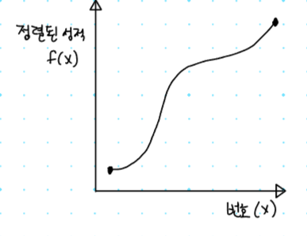
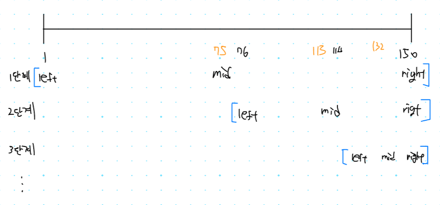

## 파라메트릭 서치를 위한 조건

### 조건 - 이진 탐색의 조건인 단조 증가/감소

찾고자 하는 값이 있을때, 그 값을 찾기 위해서 시작점 중간점 끝점의 값을 이용해서 찾는것이 이진 탐색 입니다.

이때 **단조 증가 혹은 단조 감소**인(정렬된) 경우에 **이진 탐색**을 할 수 있는데

입력값인 `x`값이 증가하면, 출력값 `f(x)`값도 증가하는 형태를 **단조 증가**입니다.



### 최적화 문제를 결정 문제(’예’ 혹은 ‘아니오’)로 바꾸어 해결

특정한 조건을 만족하는 가장 알맞은 값을 빠르게 찾는 최적화 문제가 파라메트릭 서치 입니다.

최대 값이나 최소값을 찾는 문제가 대표적인 파라메트릭 서치 문제 입니다.

**예시**

`x`가 학생의 번호이고 `f(x)` 결과 값이 학생의 성적인 경우 성적이 70점 이상인 학생을 찾는 문제

### 파라메트릭 서치 코딩 테스트 문제

[2512번: 예산](https://www.acmicpc.net/problem/2512) 문제는 파라메트릭 서치를 이용해서 풀 수 있는 문제 입니다.

**문제 설명**

총 예산과 지방에서 요청한 예산이 주어지면 가능한 최대한의 예산을 배분하는 프로그램을 작성하는 문제 입니다.

**문제 해결 아이디어**

적절한 **상한 금액을 찾는것**이 목표 입니다.

**예시 )** 전체 국가 예산 `485`
4개의 지방 예산 요청이 `120, 110, 140, 150` 인 경우

1. 배정된 총 예산이 조건을 만족한다면, **상한 금액을 증가** 시킨다.
2. 배정된 총 예산이 조건을 만족하지 못한다면, **상한 금액을 감소** 시킨다.



**정답 코드**

```tsx
// 2512번: 예산
let fs = require("fs");
let input = fs.readFileSync("/dev/stdin").toString().split("\n");
let n = Number(input[0].split(" ")[0]);
let arr = input[1].split(" ").map(Number);
let m = Number(input[2]);

// 최적 금액을 찾기 위한 시작점(left)
let start = 1;
// 최적 금액을 찾기 위한 끝점(right)
let end = arr.reduce((a, b) => Math.max(a, b), 0);
// 최적의 해
let result = 0;

// left 와 right가 같거나 end 크면 계속검사
while (start <= end) {
  // 현재의 중간 금액(상한액)
  let mid = parseInt((start + end) / 2);
  // 현재 상한액을 기준으로 계산한 예산의 합.
  let total = 0;
  for (x of arr) {
    // 예시 ) 현재 상한액이 75라면 요청액중에 75 보다 작은 값만 더해서 합계를 냅니다.
    total += Math.min(mid, x);
  }
  // 현재 상한액 기준으로 계산한 예산을, 최대로 쓸수 있는 예산을 비교
  if (total <= m) {
    // 만약 최대 예산 보다 총예산이 더 작으면 시작점을 상한액 + 1으로 변경
    result = mid;
    start = mid + 1;
  } else {
    // 만약 최대 예산 보다 총예산이 더 크면 상한액을 감소
    end = mid - 1;
  }
}
console.log(result);
```