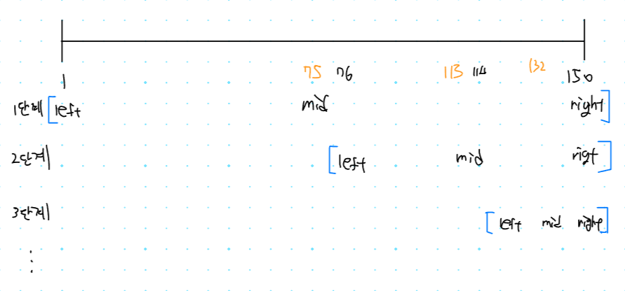
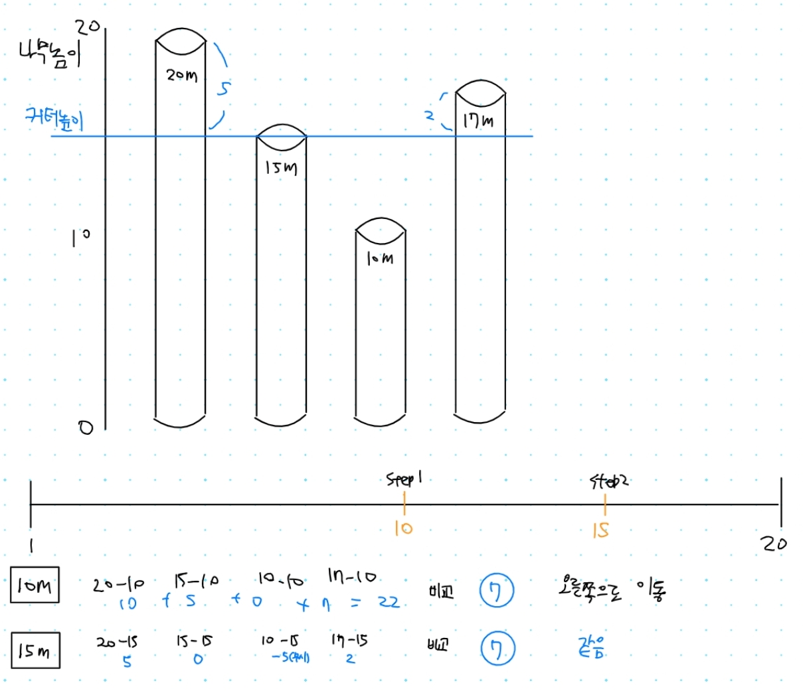

## 1. 2512번: 예산

[2512번: 예산](https://www.acmicpc.net/problem/2512)

총 예산과 지방에서 요청한 예산이 주어지면 가능한 최대한의 예산을 배분하는 프로그램을 작성하는 문제 입니다.

### 문제 해결 아이디어

적절한 **상한 금액을 찾는것**이 목표 입니다.

**예시 )** 전체 국가 예산 `485`
4개의 지방 예산 요청이 `120, 110, 140, 150` 인 경우

1. 배정된 총 예산이 조건을 만족한다면, **상한 금액을 증가** 시킨다.
2. 배정된 총 예산이 조건을 만족하지 못한다면, **상한 금액을 감소** 시킨다.



### 정답 코드

```tsx
// 2512번: 예산
let fs = require("fs");
let input = fs.readFileSync("/dev/stdin").toString().split("\n");
let n = Number(input[0].split(" ")[0]);
let arr = input[1].split(" ").map(Number);
let m = Number(input[2]);

// 최적 금액을 찾기 위한 시작점(left)
let start = 1;
// 최적 금액을 찾기 위한 끝점(right)
let end = arr.reduce((a, b) => Math.max(a, b), 0);
// 최적의 해
let result = 0;

// left 와 right가 같거나 end 크면 계속검사
while (start <= end) {
  // 현재의 중간 금액(상한액)
  let mid = parseInt((start + end) / 2);
  // 현재 상한액을 기준으로 계산한 예산의 합.
  let total = 0;
  for (x of arr) {
    // 예시 ) 현재 상한액이 75라면 요청액중에 75 보다 작은 값만 더해서 합계를 냅니다.
    total += Math.min(mid, x);
  }
  // 현재 상한액 기준으로 계산한 예산을, 최대로 쓸수 있는 예산을 비교
  if (total <= m) {
    // 만약 최대 예산 보다 총예산이 더 작으면 시작점을 상한액 + 1으로 변경
    result = mid;
    start = mid + 1;
  } else {
    // 만약 최대 예산 보다 총예산이 더 크면 상한액을 감소
    end = mid - 1;
  }
}
console.log(result);
```

## 2. 2805번: 나무 자르기

[2805번: 나무 자르기](https://www.acmicpc.net/problem/2805)

집으로 가져갈 수 있는 나무의 길이가 주어지고, 자를 수 있는 나무의 길이가 주어집니다.

절단기는 높이를 지정하면 그 높이 위에있는 나무를 자르는 방식이면 나무를 가져가기 위한 절단기 높이의 최댓값을 출력하는 프로그램을 작성하는 문제입니다.

### 문제 해결 아이디어

적절한 높이를 구하기 위해서 파라메트릭 서치를 하는것이 목표인 문제 입니다.

1. 절단기의 높이가 **올라가는** 경우: 얻을 수 있는 나무의 양이 **감소.**
2. 절단기의 높이가 **내려가는** 경우: 얻을 수 있는 나무의 양이 **증가.**



### 내가 작성한 코드(성공 ✅)

예산 문제와 비슷하게 작성했더니 성공 했습니다.

최적의 해를 구하기 위해서 가져갈수있는 나무의 길이와 총 자른 **나무의 길이를 비교**해서, **더 많이 자른다면 오른쪽으로 이동**하고 **그 반대라면 왼쪽으로 이동**하여 최적의 해를 찾습니다.

```jsx
// 2. 2805번: 나무 자르기
let fs = require("fs");
let input = fs.readFileSync("/dev/stdin").toString().split("\n");
let [n, m] = input[0].split(" ").map(Number);
let trees = input[1].split(" ").map(Number);

let left = 1;
let right = Math.max(...trees);
let result = 0;

while (left <= right) {
  let mid = parseInt((left + right) / 2);
  let sum = 0;
  for (tree of trees) {
    if (tree - mid > 0) sum += tree - mid;
  }
  if (sum >= m) {
    // 오른쪽으로 이동
    result = mid;
    left = mid + 1;
  } else {
    // 왼쪽으로 이동
    right = mid - 1;
  }
}
console.log(result);
```

## 3. 1654번: 랜선 자르기

[1654번: 랜선 자르기](https://www.acmicpc.net/problem/1654)

### 문제 해결 아이디어

랜선의 개수 N개 이상을 얻을 수 잇는 길이의 최댓값을 구하는 문제 입니다.

1. 길이를 **키우면**, 얻을 수 있는 랜선의 수는 **감소** 합니다.
2. 길이를 줄이**면**, 얻을 수 있는 랜선의 수는 **증가** 합니다.

### 내가 작성한 코드(성공 ✅)

앞선 나무 자르기 문제와 유사하여 조건문만 조금 바꿔서 정답판정을 얻었습니다.

```jsx
// 3. 1654번: 랜선 자르기
let fs = require("fs");
let input = fs.readFileSync("dev/stdin").toString().split("\n");
let [k, n] = input[0].split(" ").map(Number);
let cables = [];
for (let i = 1; i <= k; i++) cables.push(Number(input[i]));

let left = 1;
let right = Math.max(...cables);
let result = 0;

while (left <= right) {
  let mid = parseInt((left + right) / 2);
  let sum = 0;
  for (cable of cables) {
    sum += parseInt(cable / mid);
  }
  if (sum < n) {
    // 왼쪽으로 이동
    right = mid - 1;
  } else {
    result = mid;
    left = mid + 1;
  }
}
console.log(result);
```