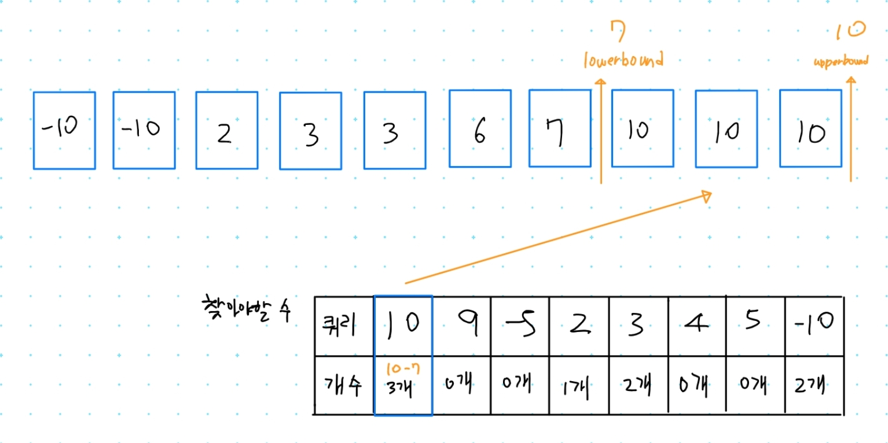
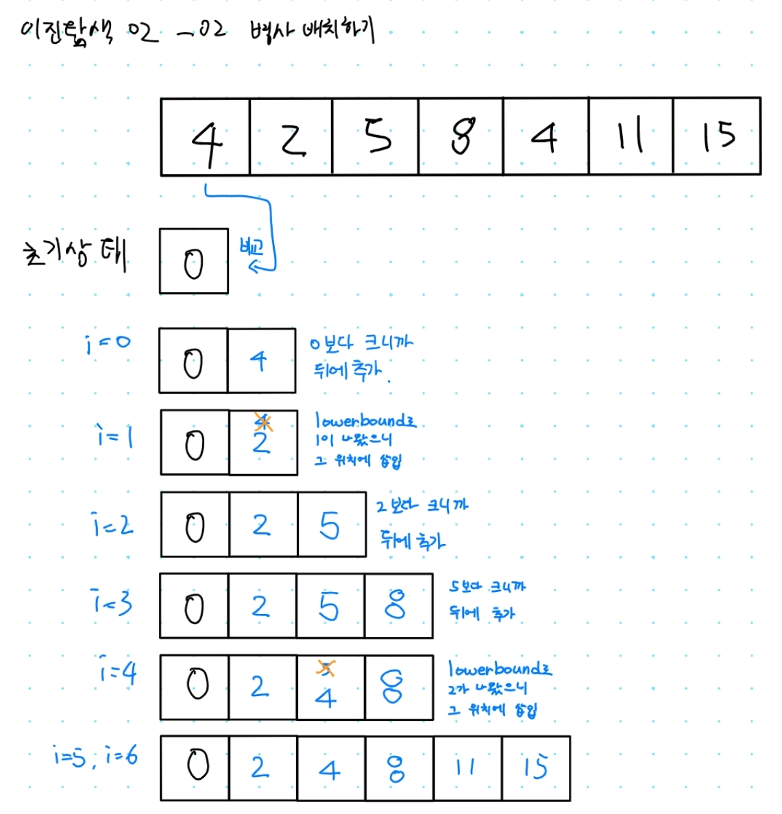
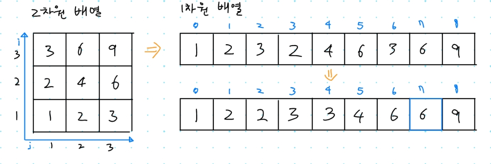
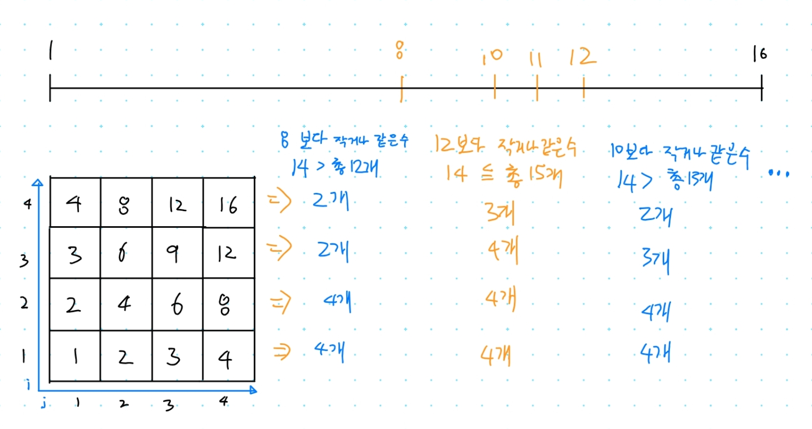

## 1. 10186번: 숫자 카드 2

[10816번: 숫자 카드 2](https://www.acmicpc.net/problem/10816)

N개의 숫자 카드를 가지고 있을 때, M개의 특정한 숫자의 카드가 몇개 들어있는지 구하는 프로그램을 작성하는 문제입니다.

### 문제 풀이 아이디어

이진 탐색 함수에서 제공하는(js는 직접 구현필요) **lowerBound**와 **upperBound**를 이용해서 풀면 간단하게 해결할 수 있습니다.



### 내가 작성한 코드(정답 인정 ✅)

1. 이진 탐색을 위해 배열을 오름 차순 정렬 합니다.
2. **countByRange**함수로 `오른쪽 인덱스 - 왼쪽 인덱스` 계산해서 갯수를 구합니다.

```jsx
// 1. 10816번: 숫자 카드 2
let fs = require("fs");
let input = fs.readFileSync("/dev/stdin").toString().split("\n");
let n = Number(input[0]);
let cards = input[1].split(" ").map(Number);
let m = Number(input[2]);
let arr = input[3].split(" ").map(Number);
let result = "";
cards.sort((a, b) => a - b);

// 정렬된 순서를 유지하면서 배열에 삽입할 가장 왼쪽 인덱스 반환
function lowerBound(arr, target) {
  let start = 0;
  let end = arr.length;
  while (start < end) {
    let mid = parseInt((start + end) / 2);
    if (arr[mid] >= target) end = mid; // 최대한 왼쪽으로 이동하기
    else start = mid + 1;
  }
  return end;
}

// 정렬된 순서를 유지하면서 배열에 삽입할 가장 오른쪽 인덱스 반환
function upperBound(arr, target) {
  let start = 0;
  let end = arr.length;
  while (start < end) {
    let mid = parseInt((start + end) / 2);
    if (arr[mid] > target) end = mid;
    else start = mid + 1; // 최대한 오른쪽으로 이동하기
  }
  return end;
}

// 값이 [leftValue, rightValue]인 데이터의 개수를 반환하는 함수
function countByRange(arr, value) {
  // 유의: lowerBound와 upperBound는 end 변수의 값을 배열의 길이로 설정
  let rightIndex = upperBound(arr, value);
  let leftIndex = lowerBound(arr, value);
  return rightIndex - leftIndex;
}

for (x of arr) {
  result += countByRange(cards, x) + " ";
}
console.log(result.trim());
```

### 강사님 정답 코드

제 코드와 변수 선언 빼고는 동일해서 생략하겠습니다.

## 2. 18353번: 병사 배치하기

[18353번: 병사 배치하기](https://www.acmicpc.net/problem/18353)

### 문제 해결 아이디어

본 문제는 특정한 수열에서 **가장 긴 증가하는 부분 수열**을 찾는 문제 입니다.

**Longest Increasing Subsequence (LIS) 알고리즘**으로 찾을 수 있습니다.

1. 현재 병사의 전투력이 가장 크다면 맨 뒤에 삽입 합니다.
2. 가장 크지 않다면 전투력에 맞게 lowerBound로 자기 위치 원소와 교체합니다.



### 내가 작성한 코드(오답 ❌)

어떻게 이진 탐색을 사용해야 할지 모르겠어서 일단 간단하게 생각을 해서 풀어보았더니 틀렸습니다.

앞에 숫자와 뒤에 숫자를 비교해서 뒤가 더 큰경우에만 없애는 방식을 생각해보았는데

주어진 숫자는 어느정도는 정렬이 된 예시라서 결과는 같긴 했지만, 완전 무작위로 숫자를 섞으면 답을 찾기 어려운 코드라서 오답처리가 된것같습니다.

```jsx
// 2. 18353번: 병사 배치하기
let fs = require("fs");
let input = fs.readFileSync("dev/stdin").toString().split("\n");
let n = Number(input[0]);
let soldiers = input[1].split(" ").map(Number);
soldiers.push(0);
let answer = 0;

for (let i = 0; i < soldiers.length - 1; i++) {
	// 앞뒤 전투력을 비교해서 뒤숫자가 더 크면 그 병사는 열외시킵니다.
  if (soldiers[i] <= soldiers[i + 1]) answer++;
}
console.log(answer);
```

### 강사님 정답 코드

잘 이해 되지는 않지만 전투력 순으로 정렬을 위해서 **lowerBound로** 병사가 들어갈 수 있는 위치를 찾아서 교체하는 방식 이라서 이진 탐색 으로 취급 받는것같습니다.

```jsx
// 2. 18353번: 병사 배치하기
let fs = require("fs");
let input = fs.readFileSync("dev/stdin").toString().split("\n");
let n = Number(input[0]);
let soldiers = input[1].split(" ").map(Number);
soldiers.reverse();

let result = [0];

// 정렬된 순서를 유지하면서 배열에 삽입할 가장 왼쪽 인덱스 반환
function lowerBound(arr, target) {
  let start = 0;
  let end = arr.length;
  while (start < end) {
    let mid = parseInt((start + end) / 2);
    if (arr[mid] >= target) end = mid; // 최대한 왼쪽으로 이동하기
    else start = mid + 1;
  }
  return end;
}

for (x of soldiers) {
  if (x > result[result.length - 1]) result.push(x);
  else result[lowerBound(result, x)] = x;
  console.log(result);
}
console.log(n - (result.length - 1));
```

## 3. 1300번: K번째 수

[1300번: K번째 수](https://www.acmicpc.net/problem/1300)

N x N 크기의 2차원 배열이 있고, 배열안의 각 값은 아래 그림과 같이 i x j 를 해서 넣습니다. 만들어진 배열을 1차원 배열로 바꾸고 오름 차순 정렬한다면 K번째 수의 값을 찾는 문제 입니다.



### 문제 해결 아이디어

파라메트릭 서치로 1 ~ N^2 사이에서 mid 값 보다 작거나 같은 원소의 개수를 찾는 방식으로 진행할 수 있습니다.

**예시 1) N이 4이고 찾고자 하는 인덱스는 14일때**



mid 값 보다 작은 값의 개수가 찾고자 하는 **인덱스보다 적다는 의미**는

찾고자 하는 **순번보다 더 앞쪽에 위치**해있다는 것을 의미 합니다.

그래서 뒤쪽에 있는 숫자를 검사하기 위해서 left를 mid로 옮기고 다시 mid값을 찾습니다.

더 크다면 최적의 해를 구하기 위해서 right를 mid로 옮기고 다시 mid값을 찾습니다.

찾고자 하는 인덱스보다 크거나 같은 개수를 가진 mid를 출력하면 됩니다.

### 내가 작성한 코드(정답 인정 ✅)

너무 어려워서 문제 해결 아이디어를 보고 작성한 코드라서 정답이긴 합니다.

파라메트릭 서치로 풀어야 겠다고 생각은 들었는데 어떤식으로 접근해야할지 고민이 많았기 때문에 설명 강의를 들었는데, 개인적으로는 정 어려우면 문제 해결 아이디어 까지만 듣고 푸는것도 좋은것같습니다.

```jsx
// 3. 1300번: K번째 수
let fs = require("fs");
let [n, k] = fs.readFileSync("/dev/stdin").toString().split("\n").map(Number);

let left = 1;
let right = n * n;

let result = 0;
while (left <= right) {
  let mid = parseInt((left + right) / 2);
  let sum = 0;
  // 각 행마다 mid보다 작은 값의 개수를 셉니다.
  for (let i = 1; i <= n; i++) {
    // i * n이 mid 보다 작거나 같다는 의미는 그 행안의 모든 수가 mid보다 작거나 같다는 의미
    if (i * n <= mid) sum += n;
    // 예 ) 3 * 1, 3 * 2, 3 * 3, 3 * 4 이 경우
    // 3을 2까지 곱했을때 8을 안넘기 때문에 8 / 3을 하면 자기보다 작은 수의 개수이다.
    else sum += parseInt(mid / i);
  }
  if (sum < k) {
    // 순번보다 더 앞쪽에 위치해있다는 것을 의미하기 때문에
    // 계속해서 뒤에 값들을 검사합니다.
    left = mid + 1;
  } else {
    // 어짜피 끝까지 검사하면 최적의 해가 나오기 때문에
    // 일단 크거나 같다면 결과값에 기록합니다.
    result = mid;
    right = mid - 1;
  }
}
console.log(result);
```

### 강사님 정답 코드

문제 해결 아이디어를 보고 짠 코드라 제 코드와 거의 비슷하지만

mid보다 작은 값의 개수를 구하는것을 간단하게 작성하여 매우 흥미로웠습니다.

```jsx
// 3. 1300번: K번째 수
let fs = require("fs");
let [n, k] = fs.readFileSync("/dev/stdin").toString().split("\n").map(Number);
let start = 1; // 배열에 존재할 수 있는 가장 작은 값 (1x1)
let end = 10 ** 10; // 배열에 존재할 수 있는 가장 큰 값 (10^5 x 10^5 = 10^10)
let result = 0;

// 이진탐색 수행
while (start <= end) {
  // 현재의 중간점
  let mid = parseInt((start + end) / 2);
  // mid보다 작거나 같은 데이터의 개수
  let total = 0;
  // 각 행마다 mid보다 작거나 같은 데이터의 개수 세기
  for (let i = 1; i <= n; i++) {
    // 보통은 행안에 값들이 다 mid보다 작아서 n개 이거나, mid / i를 계산하면 mid 보다 작은 값을 구할 수 있으니까
    // 둘중 작은것을 저장하면 해결됩니다.. 대박 신기..
    total += Math.min(parseInt(mid / i), n);
  }
  // mid보다 작거나 같은 데이터의 개수가 k 이상 이라면
  if (total >= k) {
    result = mid; // result에 기록합니다.
    end = mid - 1;
  }
  // mid보다 작거나 같은 데이터의 개수가 k 미만 이라면
  else start = mid + 1;
}
console.log(result);
```