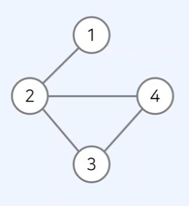
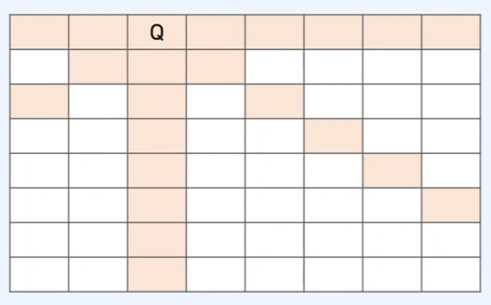
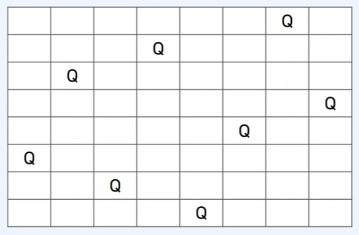

## 그래프/트리의 모든 원소를 완전 탐색하는 백트래킹 알고리즘

모든 경우에 수를 고려해야 할 때 사용할 수 있는 접근 방법 중 하나 입니다.

DFS와 차이점은 완전 탐색을 목적으로 하는 것은 같지만 **DFS는 단순히 완전 탐색**하지만

**백트래킹 알고리즘**은 조건에 따라 **유망한 노드로 이동**하는 점이 다릅니다.

### 그래프의 두 가지 표현 방식

그래프는 대표적으로 인접 행렬과 인접 리스트로 표현 할 수 있습니다.



**인접 행렬**

정점에서 갈 수 있는 다른 정점의 목록을 2차원 배열 형태로 표현 한 방식입니다.

| 0 | 1 | 0 | 0 |
| --- | --- | --- | --- |
| 1 | 0 | 1 | 1 |
| 0 | 1 | 0 | 1 |
| 0 | 1 | 1 | 0 |

**인접 리스트**

정점 마다 갈 수 있는 다른 정점의 목록을 리스트로 표현 한 방식 입니다.

| 1 | 2 |
| --- | --- |
| 2 | 1, 3, 4 |
| 3 | 2, 4 |
| 4 | 2, 3 |

### 백트래킹의 일반적인 코드 형태

```tsx
function recursive() {
	if (종료 조건을 만족){
		처리;
	}
	for 자식 노드 하나씩 확인 {
		if (임의의 조건을 만족) {
			자식 노드 방문 처리;
			재귀 함수 호출;
			자식 노드 방문 처리 해제;
		}
	}
}
```

종료 조건이 없으면 재귀 함수는 멈출 수 없기 때문에, 보통은 마지막 노드에 도착하면 종료하는 접근 방법을 사용합니다.

## 대표적인 백트래킹 문제인 N-Queen 문제

N * N 체스판에 N 개의 퀸을 놓을 때 서로 공격할 수 없게 놓는 문제입니다.

N의 개수가 커지면 커질수록 경우의 수가 매우 커지기 때문에 단순히 모든 경우의 수를 고려한다면 계산하기 힘들기 때문에 유망한 노드로 이동하는 것이 백트래킹 알고리즘의 핵심입니다.





### 문제 풀이 아이디어

1. 퀸은 본인의 행에 위치한 말을 공격할 수 있어서 1행에는 1개의 퀸만 놓을 수 있습니다.
2. 이미 존재하는 퀸의 상하좌우 및 대각선 위치가 아닌 위치에 다른 퀸 놓을 수 있습니다.

위와 같은 조건에 상충되지 않는 조건을 만족하는 위치에 대해서만 재귀 함수를 호출합니다.

**가능한 노드인지 체크하는 예시**

같은 행에 있는지 체크: `x1 === x2`

같은 열에 있는지 체크: `y1 === y2`

대각선에 있는지 체크: `abs(x1, x2) === abs(y1, y2)`

### N-Queen 정답 예시 코드

```tsx
// N-Queen 정답 코드 예시
let n = 8; // 전체 맵의 크기
let queens = []; // 현재 체스판에 놓인 퀸의 위치 정보들

function possible(x, y) {
  // x, y 위치에 퀸을 놓을 수 있는지 확인
  for (let [a, b] of queens) {
    // 현재까지 놓았던 모든 퀸의 위치를 하나씩 확인 합니다.
    if (a === x || b === y) return false; // 행이나 열이 같다면 놓을 수 없습니다.
    if (Math.abs(a - x) === Math.abs(b - y)) return false; // 대각선에 위치한 경우도 놓을 수 없습니다.
  }
  return true;
}

let cnt = 0;
function dfs(row) {
  if (row === n) cnt += 1; // 퀸을 N개 배치할 수 있는 경우 카운트를 올려줍니다.
  for (let i = 0; i < n; i++) {
    // 현재 행에 존재하는 열을 하나씩 확인 합니다.
    if (!possible(row, i)) continue; // 놓을 수 없는 위치의 경우 무시 합니다.
    queens.push([row, i]); // 현재 위치에 퀸을 놓습니다.
    dfs(row + 1); // 다음 줄 을 검사 합니다.
    queens.pop(); // 현재 위치에서 퀸을 제거 합니다.
  }
}
dfs(0);
console.log(cnt);
```