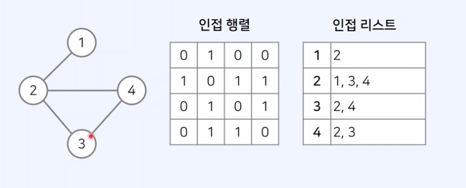
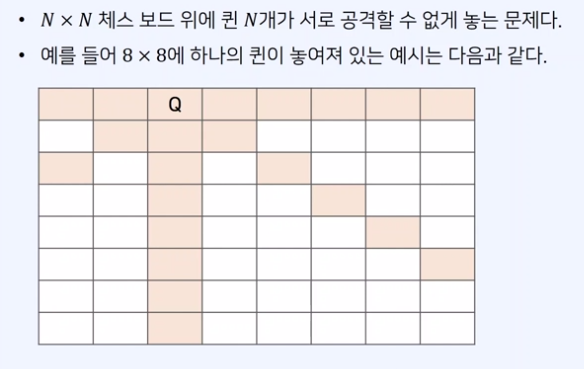
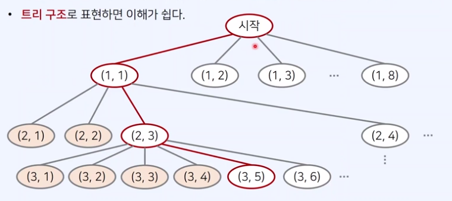
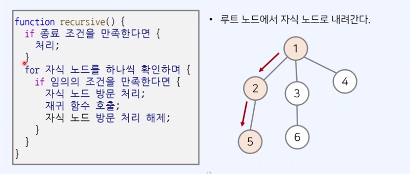
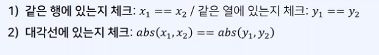

## 1. 백트래킹 (BackTracking)

- 일반적으로 그래프/트리의 모든 원소를 완전 탐색하기 위한 목적으로 사용
- 추후에 공부할 DFS와의 차이점
  1. DFS보다 백트래킹이 더 많이 출제
  2. DFS는 일반적으로 완전 탐색 목적, 재귀 함수를 이용해 구현
  3. 백트래킹도 재귀 함수를 이용하는 것이 일반적이지만, 단순히 완전 탐색하는 것이 아니라 조건에 따라서 **유망한 노드**로 이동

### 1) 그래프 표현 방식



## 2. N-Queen 문제



- 예를들어 N = 8이라고 할 때
- 64개의 위치에 8개의 퀸을 설치하는 모든 조합의 수 = Combination(64,8)
- 따라서 단순히 모든 경우의 수를 전부 고려한다면?
  -> 각 퀸이 서로 공격이 가능한지 검사하는 방식을 사용한다면 **경우의 수가 매우 커질 수 있다.**

### 1) 문제해결 아이디어

    - 완전 탐색을 하더라도 유망한 경우에 대해서만 탐색을 진행한다면?
    - 그러한 백트래킹 방식을 사용하여 훨씬 경우의 수를 줄일 수 있다.

### 2) 문제 이해하기

    - N개의 퀸을 놓기 위해서는 각 행마다 1개씩 퀸을 놓아야 한다.
    - 하나의 A가 이미 존재하는 상태에서, 다른 퀸 B를 놓으려면 어떻게 해야 할까?
    

### 3) 문제 해결 방법

    - 백트래킹 진행 시 경우의 수를 최대한 줄이는 방법
    방법 : 이전까지 놓았던 퀸들과 상충되지 않는 조건을 만족하는 위치에 대해서만 재귀 함수를 호출
    1) 재귀 함수를 통해 모든 경우의 수를 다 찾은 뒤, 각 경우마다 가능한지 검사하는 방법
    2) **유망한 경우**에 대해서만 재귀 함수를 호출하는 방법
    -> 위 경우에서는 2) 방법이 더 효율적

## 3. 백트래킹의 기본 형태



## 4. N-Queen 문제 해결 아이디어

- 가능한 모든 조합의 수를 구하는 것
- 매 재귀함수마다 실제로 N x N 모든 위치를 볼 필요가 없다.
  **[ 핵심 ]** 맨 처음 행(row)부터 차례대로 퀸을 놓는다고 생각하면 가짓수를 훨씬 줄일 수 있다.
- N-Queen 문제는 가능한 조합을 계산하는 것, 현재 행의 이전 행으로 돌아갈 필요가 없다.

- 백트래킹은 기본적으로 **가능한 노드**에 대하여 계속해서 재귀적으로 함수 호출
- 백트래킹은 모든 경우의 수를 탐색하기에 적합하다.
- N-Queen 문제를 해결하기 위해서는 **특정 위치(노드)의 가능 여부**를 판단할 필요가 있다.
- 가능한 노드 여부는 다음의 두가지를 확인
  

## 5. N-Queen 정답 코드 예시

```js
let n = 8; // 전체 map의 크기
let queens = []; // 현재 체스판에 놓인 퀸(queen)의 위치 정보들

function possible(x, y) {
  // (x, y) 위치에 퀸을 놓을 수 있는지 확인
  for (let [a, b] of queens) {
    // 현재까지 놓았던 모든 queen의 위치를 하나씩 확인하며
    if (a == x || b == y) return false; // 행이나 열이 같다면 X
    if (Math.abs(a - x) == Math.abs(b - y)) return false; // 대각선 위치한 경우 X
  }
  return true;
}

let cnt = 0;
function dfs(row) {
  if (row == n) cnt += 1; // queen을 N개 배치할 수 있는 경우 카운트
  for (let i = 0; i < n; i++) {
    // 현재 행(row)에 존재하는 열을 하나씩 확인하며
    if (!possible(row, i)) continue; // 현재 위치에 놓을 수 없다면 무시
    queens.push([row, i]); // 현재 위치에 퀸 놓기
    dfs(row + 1); // 재귀함수 호출
    queens.pop(); // 현재 위치에서 퀸 제거
  }
}
dfs(0);
console.log(cnt);
```
