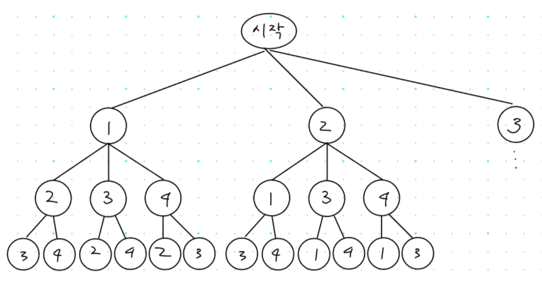

## 1. 15649번: N과 M (1)

[15649번: N과 M (1)](https://www.acmicpc.net/problem/15649)

자연수 N과 M이 주어졌을 때, 1부터 N까지 자연수 중에서 중복 없이 길이가 M인 수열을 모두 구하는 문제 입니다.

### 문제 해결 아이디어

4개의 수(1, 2, 3, 4) 중에 3개를 고르는 모든 순열을 고려하면 아래 그림과 같습니다.



재귀 함수를 사용하여 깊이가 3일때 멈추면 되고, 또한 중복을 허용하지 않기 때문에 한 번 선택된 원소는 방문 처리를 해야 합니다.

### 정답 예시 코드

아직 백트래킹 알고리즘에 익숙하지 않아서, 시도 해보다가 시간이 길어져서 정답 및 해설을 보았습니다.

```tsx
// 1. 15649번: N과 M (1)
let fs = require("fs");
let input = fs.readFileSync("/dev/stdin").toString().split("\n");
const [n, m] = input[0].split(" ").map(Number);
const arr = []; // 1~n 까지 자연수를 담은 배열
for (let i = 1; i <= n; i++) arr.push(i);
const visited = new Array(n).fill(false); // 방문한 요소인지 저장하기 위한 배열
const selected = []; // 현재 선택한 숫자를 모아놓은 배열
let answer = ""; // 정답 담을 문자열

function recursive(depth) {
  // depth가 끝까지 도달 했을때 지금까지 선택한 숫자들을 출력을 위해 문자열로 변경
  if (depth === m) {
    for (let x of selected) answer += x + 1 + " ";
    answer += "\n";
    return;
  }
  for (let i = 0; i < arr.length; i++) {
    if (visited[i]) continue; // 이미 갔다온 숫자면 무시
    selected.push(i); // 현재 숫자를 선택
    visited[i] = true; // 방문 처리
    recursive(depth + 1); // 다음 depth로 넘어감
    selected.pop(); // 현재 숫자를 선택 취소
    visited[i] = false; // 방문 처리 해제
  }
}
recursive(0);
console.log(answer);
```

## 2. 10974번: 모든 순열

[10974번: 모든 순열](https://www.acmicpc.net/problem/10974)

N이 주어졌을 때, 1부터 N까지의 수로 이루어진 순열을 출력하는 프로그램을 작성하는 문제입니다.

### 문제 해결 아이디어

앞서 해결한 문제와 비슷하게 해결하면 정답 판정을 받을 수 있습니다.

이번 문제는 깊이인 M 값이 없기 때문에 주어진 수인 N 까지만 진행하는 코드로 변경하기만 하면 됩니다.

### 정답 예시 코드

N과 M 문제 에서 종료 조건만 수정하면 정답 판정을 받을 수 있습니다.

`const [n, m] = input[0].split(" ").map(Number);` ⇒ `const n = Number(input[0]);`

`depth === m` ⇒ `depth === n`

```tsx
// 2. 10974번: 모든 순열
let fs = require("fs");
let input = fs.readFileSync("dev/stdin").toString().split("\n");
const n = Number(input[0]);
const arr = []; // 1~n 까지 자연수를 담은 배열
for (let i = 1; i <= n; i++) arr.push(i);
const visited = new Array(n).fill(false); // 방문한 요소인지 저장하기 위한 배열
const selected = []; // 현재 선택한 숫자를 모아놓은 배열
let answer = ""; // 정답 담을 문자열

function recursive(depth) {
  // depth가 끝까지 도달 했을때 지금까지 선택한 숫자들을 출력을 위해 문자열로 변경
  if (depth === n) {
    for (let x of selected) answer += x + 1 + " ";
    answer += "\n";
    return;
  }
  for (let i = 0; i < arr.length; i++) {
    if (visited[i]) continue; // 이미 갔다온 숫자면 무시
    selected.push(i); // 현재 숫자를 선택
    visited[i] = true; // 방문 처리
    recursive(depth + 1); // 다음 depth로 넘어감
    selected.pop(); // 현재 숫자를 선택 취소
    visited[i] = false; // 방문 처리 해제
  }
}
recursive(0);
console.log(answer);
```

## 3. 7490번: 0 만들기

[7490번: 0 만들기](https://www.acmicpc.net/problem/7490)

1 2 3 … N 인 수열에서 숫자사이에 `'+'` `'-'` `' '` (공백) 을 숫자 사이에 넣어서 0이 되는 모든 수식을 찾는 문제 입니다.

### 문제 해결 아이디어

이전 문제들과는 다르게 연산자의 중복이 가능하기 때문에 **방문 처리가 필요 없다**는 점이 다릅니다.

1. 1~N까지 수열 사이에 연산자를 끼워 넣는 방식으로 문자열을 만들고
2. 문자열을 계산하는 `new Function('return ' + 연산할 문자열)()` 을 사용하여 합을 구하고
3. 0일 경우에는 콘솔에 출력 합니다.

> **💡문제 해결 Tip!**
`'+'` `'-'` `' '` 순서로 계산하면 틀렸다고 나와서 꼭 `' '` `'+'` `'-'` 순서로 계산해야 합니다!
> 

### 정답 예시 코드

```tsx
// 3. 7490번: 0 만들기
let fs = require("fs");
let input = fs.readFileSync("dev/stdin").toString().split("\n");
let n = 0;
let arr = []; // 1~n 까지 자연수를 담은 배열
const operators = [" ", "+", "-"];
const testCase = Number(input[0]);

for (let tc = 1; tc <= testCase; tc++) {
  n = Number(input[tc]);
  arr = []; // 케이스 마다 배열 비우기
  for (let i = 1; i <= n; i++) arr.push(i);
  dfs([], 0);
  console.log();
}
function dfs(result, depth) {
  if (depth === n - 1) {
    let str = "";
    for (let i = 0; i < n - 1; i++) str += arr[i] + result[i]; // 끝숫자 빼곤 다 연산자 더하기
    str += arr[n - 1] + ""; // 맨마지막 숫자는 그냥 더하기
    const sum = new Function("return " + str.split(" ").join(""))(); // 공백을 없애고 계산하기
    if (Number(sum) === 0) console.log(str); // 결과값이 0인 경우는 콘솔에 출력
    return;
  }
  for (let i = 0; i < operators.length; i++) {
    result.push(operators[i]);
    dfs(result, depth + 1);
    result.pop();
  }
}
```