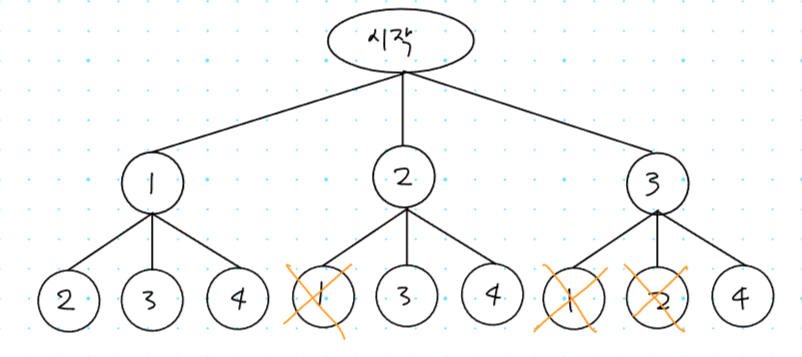

## 1. 15650번: N과 M (2)

[15650번: N과 M (2)](https://www.acmicpc.net/problem/15650)

자연수 N과 M이 주어졌을 때 길이가 M인 수열을 모두 구하는 프로그램을 작성하는 문제입니다.

조건은 다음과 같습니다.

- 1부터 N까지 자연수 중에서 중복 없이 M개를 고른 수열
- 고른 수열은 오름차순이어야 한다.

### 문제 해결 아이디어

중복 없이 모든 조합을 구하는 문제 입니다. 그래서 1 ⇒ 2 로 갔다면 다음번에는 2 ⇒ 1로는 못간다고 볼 수 있습니다. 



즉, **자기 보다 작은 값은 선택 할 수 없다**고 볼 수 있습니다.

N과 M (1) 문제와 다른 부분은 start 지점을 1씩 올려주어 자신보다 작은 값을 선택할 수 없게 하는 부분이 다릅니다.

### 정답 예시 코드

일단 설명 강의를 듣기는 했는데, 이해가 잘 안되어서 나중에 다시 풀어보면서 복습해야할것같습니다.

```tsx
// 1. 15650번: N과 M (2)
let fs = require("fs");
let input = fs.readFileSync("dev/stdin").toString().split("\n");
const [n, m] = input[0].split(" ").map(Number);
const arr = []; // 1~n 까지 자연수를 담은 배열
for (let i = 1; i <= n; i++) arr.push(i);
const visited = new Array(n).fill(false); // 방문한 요소인지 저장하기 위한 배열
const selected = []; // 현재 선택한 숫자를 모아놓은 배열
let answer = ""; // 정답 담을 문자열

function recursive(depth, start) {
  // depth가 끝까지 도달 했을때 지금까지 선택한 숫자들을 출력을 위해 문자열로 변경
  if (depth === m) {
    for (let x of selected) answer += x + 1 + " ";
    answer += "\n";
    return;
  }
  for (let i = start; i < arr.length; i++) {
    if (visited[i]) continue; // 이미 갔다온 숫자면 무시
    selected.push(i); // 현재 숫자를 선택
    visited[i] = true; // 방문 처리
    recursive(depth + 1, i + 1); // 다음 depth로 넘어감
    selected.pop(); // 현재 숫자를 선택 취소
    visited[i] = false; // 방문 처리 해제
  }
}
recursive(0, 0);
console.log(answer);
```

## 2. 15651번: N과 M (3)

[15651번: N과 M (3)](https://www.acmicpc.net/problem/15651)

자연수 N과 M이 주어졌을 때 길이가 M인 수열을 모두 구하는 프로그램을 작성하는 문제입니다.

조건은 다음과 같습니다.

- 1부터 N까지 자연수 중에서 M개를 고른 수열
- 같은 수를 여러 번 골라도 된다.

### 문제 해결 아이디어

중복을 허용하므로, 방문했는지 여부를 체크하지 않으면 해결할 수 있습니다.

### 정답 예시 코드

이전 N과 M (1) 문제에서 `visited[i] = true` 방문 여부 부분을 제거 하면 정답 판정을 받을 수 있습니다.

```tsx
// 2. 15651번: N과 M (3)
let fs = require("fs");
let input = fs.readFileSync("/dev/stdin").toString().split("\n");
const [n, m] = input[0].split(" ").map(Number);
const arr = []; // 1~n 까지 자연수를 담은 배열
for (let i = 1; i <= n; i++) arr.push(i);
const selected = []; // 현재 선택한 숫자를 모아놓은 배열
let answer = ""; // 정답 담을 문자열

function recursive(depth) {
  // depth가 끝까지 도달 했을때 지금까지 선택한 숫자들을 출력을 위해 문자열로 변경
  if (depth === m) {
    for (let x of selected) answer += x + 1 + " ";
    answer += "\n";
    return;
  }
  for (let i = 0; i < arr.length; i++) {
    selected.push(i); // 현재 숫자를 선택
    recursive(depth + 1); // 다음 depth로 넘어감
    selected.pop(); // 현재 숫자를 선택 취소
  }
}
recursive(0);
console.log(answer);
```

## 3. 15652번: N과 M (4)

[15652번: N과 M (4)](https://www.acmicpc.net/problem/15652)

1부터 N까지 자연수 중에서 M 개를 고른 수열을 찾는데, N과 M (2), N과 M (3) 문제를 섞은 느낌으로 같은 수를 여러 번 골라도 되지만 중복은 허용하지 않는 문제입니다.

### 문제 해결 아이디어

1. 같은 수는 허용하기에 사용한 수 인지는 체크를 하지 않는다.
2. 중복을 허용하지만, 같은 수는 허용하기에 시작하는 수는
`**start + 1`을 하는것이 아니라** `i` 값을 그대로 사용합니다.

### 정답 예시 코드

아무래도 재귀함수가 아직 좀 어색해서 많이 헷갈리는것같습니다.

계속해서 문제를 풀면서 익숙해지면 괜찮아 지지 않을까 싶습니다.

```tsx
// 3. 15652번: N과 M (4)
let fs = require("fs");
let input = fs.readFileSync("dev/stdin").toString().split("\n");
const [n, m] = input[0].split(" ").map(Number);
const arr = []; // 1~n 까지 자연수를 담은 배열
for (let i = 1; i <= n; i++) arr.push(i);
const selected = []; // 현재 선택한 숫자를 모아놓은 배열

let answer = ""; // 정답 담을 문자열
function recursive(depth, start) {
  // depth가 끝까지 도달 했을때 지금까지 선택한 숫자들을 출력을 위해 문자열로 변경
  if (depth === m) {
    for (let x of selected) answer += x + 1 + " ";
    answer += "\n";
    return;
  }
  for (let i = start; i < arr.length; i++) {
    selected.push(i); // 현재 숫자를 선택
    recursive(depth + 1, i); // 다음 depth로 넘어감
    selected.pop(); // 현재 숫자를 선택 취소
  }
}
recursive(0, 0);
console.log(answer);
```