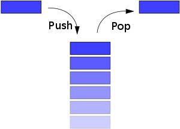
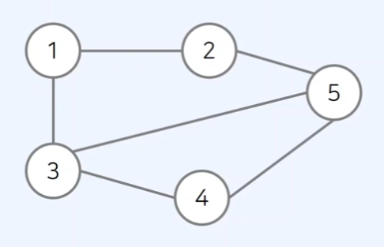

## DFS와 BFS 알고리즘

깊이 우선 탐색(Depth-first search) / 너비 우선 탐색(Breadth-first search)은

대표적인 그래프 탐색 알고리즘으로 DFS와 BFS는 코딩 테스트에서 매우 자주 등장하는 유형입니다.

탐색이란 많은 양의 데이터 중에서 원하는 데이터를 찾는 과정을 의미 합니다.

위와 같은 탐색 알고리즘을 이해하기 위해서는 **스택 (Stack) 자료구조**에 대해서 이해할 필요가 있습니다.

### DFS를 이해하기 전 알아야 할 스택(Stack) 자료구조

**먼저 들어온 데이터가 나중에 나가는** 형식(선입후출)의 자료구조 입니다.



> By User:Boivie - made in Inkscape, by myself User:Boivie. Based on Image:Stack-sv.png, originally uploaded to the Swedish Wikipedia in 2004 by sv:User:Shrimp, 퍼블릭 도메인, https://commons.wikimedia.org/w/index.php?curid=1439935
> 

```tsx
stack = [];

// 삽입(5) - 삽입(2) - 삽입(3) - 삽입(7) - 삭제() - 삽입(1) - 삽입(4) - 삭제()
stack.push(5);
stack.push(2);
stack.push(3);
stack.push(7);
stack.pop();
stack.push(1);
stack.push(4);
stack.pop();

console.log(stack) // 실행 결과 : [5, 2, 3, 1]
```

### DFS를 이해하기 전 알아야 할 그래프의 표현방식

일반적으로 JavaScript로 DFS와 같은 그래프 문제를 해결할 때는 2차원 배열(리스트)로 그래프를 표현 합니다.



**인접 리스트**

| 노드 | 인접 노드 |
| --- | --- |
| 1 | 2, 3 |
| 2 | 1, 5 |
| 3 | 1, 4, 5 |
| 4 | 3, 5 |
| 5 | 2, 3, 4 |

## 깊이 우선 탐색(DFS)이란?

그래프 혹은 트리에서 **모든 노드를 한 번씩 탐색**하기 위한 기본적인 방법입니다.

완전 탐색을 수행하기 위해 사용할 수 있는 가장 간단한 방법 중 하나이며 **스택 자료구조를 사용**합니다.

### DFS 기본 동작 방식

DFS는 다음과 같은 방법으로 동작합니다.

1. **시작 노드**를 스택에 넣고 **[방문 처리]** 합니다.
2. 스택에 마지막에 들어온 노드에 방문하지 않은 인접 노드가 있는지 확인합니다.
    1. 있다면 방문하지 않은 인접 노드를 스택에 삽입하고 [방문 처리] 합니다.
    2. 없다면 스택에 마지막으로 들어온 노드를 스택에서 추출합니다.
3. 2번 과정을 더 이상 반복할 수 없을 때까지 반복합니다.


> By Mre - 자작, CC BY-SA 3.0, https://commons.wikimedia.org/w/index.php?curid=6342841
> 

## 깊이 우선 탐색(DFS) 소스 코드 예시

```tsx
function dfs(graph, v, visited) {
	// 현재 노드를 방문처리
	visited[v] = true;
	console.log(v);
	// 현재 노드와 연결된 다른 노드를 재귀적으로 방
	for(i of graph[v]) {
		if(!visited[i]){
			dfs(graph, i, visited);
		}
	}
}
```

```tsx
// 각 노드가 연결된 정보를 표현
graph = [
	[],
	[2,3,4],
	[1],
	[1,5,6],
	[1,7],
	[3,8],
	[3],
	[4],
	[5]
]
// 각 노드가 방문된 정보를 표현
visited = new Array(9).fill(false);
// 정의된 DFS함수 호출
dfs(graph, 1, visited);
```