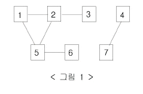

## 1. 2606번: 바이러스

[2606번: 바이러스](https://www.acmicpc.net/problem/2606)

웜 바이러스는 한 컴퓨터가 바이러스에 걸리면 감염된 컴퓨터와 네트워크에 연결된 모든 컴퓨터가 감염되는 바이러스 입니다. 



이때 바이러스에 걸리게 되는 컴퓨터의 수를 구하는 문제 입니다.

(맨 처음 걸린 컴퓨터는 카운트에서 제외)

### 문제 해결 아이디어

DFS를 사용해서 1번 노드에서 출발해 그래프 탐색을 진행합니다.

인접 리스트를 사용해서 인덱스 0번은 사용하지 않도록 하면 좋습니다. 

그 이유는 문제에서 제공하는 숫자가 인덱스 번호가 아닌 노드 숫자 이기 때문에

주어진 숫자에 맞추어서 진행하면 이해하는 것이 더 쉽기 때문입니다.

### 정답 코드 예시

기본 DFS 코드 예시와 비슷하게 작성하면 쉽게 정답 판정을 받을 수 있습니다.

```tsx
let fs = require("fs");
let input = fs.readFileSync("/dev/stdin").toString().split("\n");
const n = Number(input[0]);
const m = Number(input[1]);
const graph = [...new Array(n + 1)].map(() => []);
for (let i = 2; i <= m + 1; i++) {
  let [x, y] = input[i].split(" ").map(Number);
  graph[x].push(y);
  graph[y].push(x);
}
const visited = new Array(n + 1).fill(false);
let cnt = 0;

function dfs(x) {
  visited[x] = true;
  cnt++;
  for (let y of graph[x]) {
    if (!visited[y]) dfs(y);
  }
}
dfs(1);
console.log(cnt - 1);
```

## 2. 1012번: 유기농 배추

[1012번: 유기농 배추](https://www.acmicpc.net/problem/1012)

상하좌우로 인접한 배추의 해충을 잡아먹는 배추흰지렁이를 배추밭에 키워서 유기농 배추를 키울 때, 필요한 최소의 배추흰지렁이 마리 수를 구하는 문제 입니다.

### 문제 해결 아이디어

연결 요소는 일종의 묶음으로 이해하면 편합니다.

왼쪽 위부터 오른쪽 아래까지 하나 씩 확인해서 **방문하지 않은** 1을 가진 요소에서만 dfs 함수를 실행하고 카운트를 올려줍니다.

### 정답 코드 예시

1. testCase만큼 반복 해서 > graph 생성, 방문 하지 않은 `1`인 요소 찾기
2. dfs에서 반환하는 값이 true 일 경우만 카운트를 올리기

```tsx
// 2. 1012번: 유기농 배추
let fs = require("fs");
let input = fs.readFileSync("/dev/stdin").toString().split("\n");
let line = 1;
const caseCount = Number(input[0]);
for (let i = 0; i < caseCount; i++) {
  let answer = 0;
  const [m, n, k] = input[line].split(" ").map(Number);
  const graph = [];
  for (let i = 0; i < n; i++) {
    graph[i] = new Array(n).fill(0);
  }
  for (let i = 0; i < k; i++) {
    let [y, x] = input[line + i + 1].split(" ").map(Number);
    graph[x][y] = 1;
  }

  for (let i = 0; i < n; i++) {
    for (let j = 0; j < m; j++) {
      if (dfs(graph, n, m, i, j)) answer++;
    }
  }
  line += k + 1;
  console.log(answer);
}

function dfs(graph, n, m, x, y) {
  if (x <= -1 || x >= n || y <= -1 || y >= m) return false; // 밭을 넘어가면 종료
  if (graph[x][y] === 1) {
    graph[x][y] = -1;
    dfs(graph, n, m, x - 1, y);
    dfs(graph, n, m, x, y - 1);
    dfs(graph, n, m, x + 1, y);
    dfs(graph, n, m, x, y + 1);
    return true;
  }

  return false;
}
```