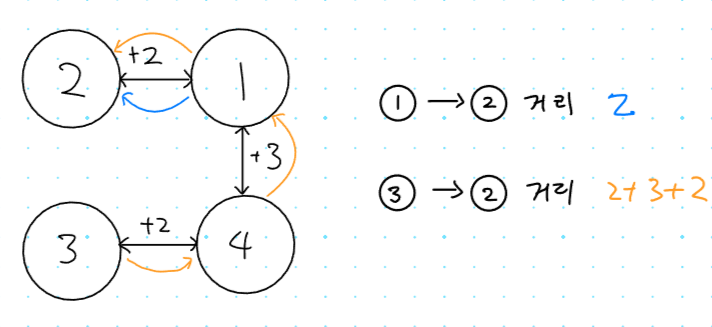
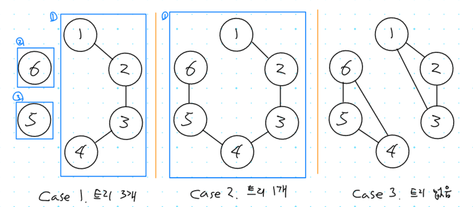

## 1. 1240번: 노드사이의 거리

[1240번: 노드사이의 거리](https://www.acmicpc.net/problem/1240)

N개의 노드로 이루어진 트리가 있을 때 주어진 두 노드 사이의 거리를 출력하는 문제 입니다.

- 본 문제에서는 트리가 **양방향 간선**으로 구성되어 있다고 가정합니다.
- 트리에서 노드A와 B를 잇는 **경로는 오직 1개**만 존재합니다.
- 주어지는 그래프는 항상 트리 형식 이므로 간선의 개수는 `N - 1` 입니다.

### 문제 해결 아이디어

트리에서 임의의 두 노드 간의 경로가 1개 뿐이기 때문에 단순히 매 쿼리 마다, 노드 A ⇒ B까지 거리를 계산 하면 됩니다.



DFS는 깊이 우선 **탐색**이기 때문에, 시작점에서 **방문 가능한 모든 노드를 방문한 후** 끝점 까지의 거리를 출력하면 됩니다.

**예시 ) 3번 노드에서 2번 노드를 갈 때**

3번에서 갈 수 있는 **모든 노드를 간 후**에 그 다음 **2번까지 누적된 거리**를 출력하면 됩니다.

1. 우선 모든 요소를 방문 **3 → 4 → 1 → 2 = `2 + 3 + 2`**
2. 2번 까지의 누적된 거리는 `7`이므로 출력

### 정답 코드 예시

실수했던 부분이라면 종료 시점을 어떻게 할까 생각하면서 시간을 많이 쓴 것 같은데, 다 방문했다면 자연스레 종료하기 때문에 굳이 종료 조건은 필요 없었습니다.

그리고 단순히 거리를 숫자를 계속 더해서 도착지에 도착하면 그 값을 출력할 줄 알았는데, 우선 모든 곳을 다 방문하고 종료되면 그때 배열에 저장된 값을 출력하는 점도 새로웠습니다.

```tsx
// 1. 1240번: 노드사이의 거리
let fs = require("fs");
let input = fs.readFileSync("dev/stdin").toString().split("\n");
const [n, m] = input[0].split(" ").map(Number);
const tree = [...new Array(n + 1)].map(() => []);
for (let i = 1; i < n; i++) {
  const [a, b, dist] = input[i].split(" ").map(Number);
  tree[a].push([b, dist]);
  tree[b].push([a, dist]);
}
// DFS 함수 구현
function dfs(a, dist) {
  if (visited[a]) return; // 이미 방문한 노드면 무시
  visited[a] = true; // 노드 방문 처리
  distance[a] = dist; // 방문한 곳 까지의 거리를 저장
  for (let [b, cost] of tree[a]) dfs(b, dist + cost); // 연결된 노드 방문하기
}
// 각 쿼리 마다 dfs를 실행하기
for (let i = 0; i < m; i++) {
  // 시작점과 목적지 가져오기
  const [a, b] = input[n + i].split(" ").map(Number);
  visited = new Array(n + 1).fill(false); // 방문여부는 매 쿼리마다 초기화 필요함
  distance = new Array(n + 1).fill(-1); // 비용을 저장하는 배열도 초기화 필요
  dfs(a, 0); // 시작점은 비용을 카운트 안하기에 0부터 시작
  console.log(distance[b]); // 모두 방문 한 후 끝점까지의 누적된 비용 출력
}
```

## 2. 4803번: 트리

[4803번: 트리](https://www.acmicpc.net/problem/4803)

트리는 사이클이 없는 연결 요소를 뜻합니다. 즉 정점이 N개 일 때 n-1개의 간선이 있는 경우, 그리고 임의의 두 정점에 경로가 유일한 경우 트리에 해당합니다.

각 테스트 케이스 마다 정점의 개수와 간선의 개수가 주어지면 트리가 몇 개 존재하는지 구하는 문제 입니다.

### 문제 해결 아이디어

트리는 사이클이 없는 연결 요소입니다. 트리의 정의에 따라서 DFS를 이용해 트리의 개수를 계산하여 문제를 해결할 수 있습니다.



위에 사진에서 알 수 있는 부분은 사이클 여부에 따라 트리인지 확인 가능합니다.

때문에 사이클이 있는지 확인하는 로직을 구현해서 문제를 해결해야 합니다.

**사이클 확인 로직**

- 인접한 노드가 이미 방문한 노드라면 → 한 바퀴 다 돌았다는 거니까 사이클이다.
- 방향이 정해지지 않은 그래프라서 직전 노드는 가면 안됩니다.

즉, 방문한 적은 있는데 이전 노드는 아니라면 사이클입니다.

### 정답 코드 예시

아직 재귀함수 로직을 완벽히 사용하기에는 조금 어려움이 있는것같습니다.

문제를 많이 풀면서 익숙해져야 겠습니다.

```tsx
// 2. 4803번: 트리
let fs = require("fs");
let input = fs.readFileSync("/dev/stdin").toString().split("\n");
let line = 0;
let testCase = 1;

function isCycle(x, prev) {
  visited[x] = true;
  for (let y of graph[x]) {
    // 방문한적 없는 노드일때
    if (!visited[y]) {
      // 사이클이 있으면 종료 합니다.
      if (isCycle(y, x)) return true;
    } else if (y != prev) return true; // 방문한적은 있는데 직전 방문은 아니라면 사이클 입니다.
  }
  return false; // 위조건들이 아니면 트리구조
}

while (true) {
  const [n, m] = input[line].split(" ").map(Number);
  if (n === 0 && m === 0) break; // 끝에 도달하면 while 반복 종료
  graph = [...new Array(n + 1)].map(() => []);
  for (let i = 1; i <= m; i++) {
    const [x, y] = input[line + i].split(" ").map(Number);
    graph[x].push(y);
    graph[y].push(x);
  }
  visited = new Array(n + 1).fill(false);
  let cnt = 0;
  // 모든 노드에 사이클이 있는지 확인 합니다.
  for (let i = 1; i <= n; i++) {
    // 방문한적이 없고
    if (!visited[i]) {
      // 사이클이 없으면 카운트를 올려줍니다.
      if (!isCycle(i, 0)) cnt++;
    }
  }

  if (cnt === 0) console.log(`Case ${testCase}: No trees.`);
  else if (cnt === 1) console.log(`Case ${testCase}: There is one tree.`);
  else console.log(`Case ${testCase}: A forest of ${cnt} trees.`);
  line += m + 1;
  testCase++;
}
```