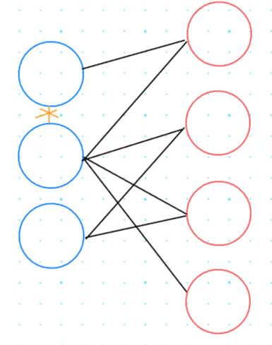
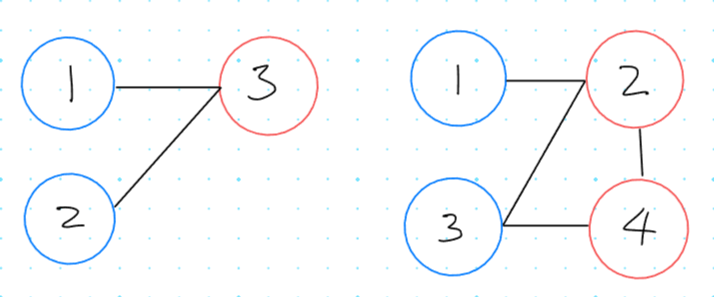

## 1. 1707번: 이분 그래프

[1707번: 이분 그래프](https://www.acmicpc.net/problem/1707)



집합 두 개가 있고, 서로 자신이 소속한 집합끼리는 인접하지 않고, 다른 집합에는 정점끼리 이어져 있는 그래프를 이분 그래프(Biparite Graph)라고 합니다.

그래프가 입력으로 주어졌을 때, 이분 그래프가 맞는지 아닌지 판별하는 문제 입니다.

예시) 사랑의 짝대기 처럼 남자 여자 그룹이 있을 때, 자신이 소속한 그룹 (남자 혹은 여자)에는 표를 줄 수 없지만 다른 그룹에는 표를 줄 수 있는 경우가 이분 그래프라고 볼 수 있다.

### 문제 해결 아이디어

**1번 케이스 “YES”**

- 1번 → 3번
- 2번 → 3번

**2번 케이스 “NO”**

- 1번 → 2번
- 2번 → 3번
- 3번 → 4번
- 4번 → 2번



### 정답 코드 예시

```tsx
// 1. 1707번: 이분 그래프
let fs = require("fs");
let input = fs.readFileSync("/dev/stdin").toString().split("\n");
class Queue {
  constructor() {
    this.storage = new Map();
    this.front = 0;
    this.rear = 0;
  }

  size() {
    return this.storage.size;
  }

  add(value) {
    if (!this.storage.size) {
      this.storage.set(0, value);
    } else {
      this.rear += 1;
      this.storage.set(this.rear, value);
    }
  }

  pop() {
    const item = this.storage.get(this.front);
    if (this.storage.size === 1) {
      this.storage.clear();
      this.front = 0;
      this.rear = 0;
    } else {
      this.storage.delete(this.front);
      this.front += 1;
    }
    return item;
  }
}

let testCases = Number(input[0]);
let line = 1;

// 미방문 (-1), 빨강 (0), 파랑 (1)
function bfs(x, graph, visited) {
  const queue = new Queue();
  queue.add(x);
  visited[x] = 0;
  while (queue.size() !== 0) {
    const v = queue.pop();
    for (let y of graph[v]) {
      if (visited[y] === -1) {
        visited[y] = (visited[v] + 1) % 2; // 빨강 <=> 파랑
        queue.add(y);
      }
    }
  }
}

function isBipartite(graph, visited) {
  for (let x = 1; x < visited.length; x++) {
    for (let y of graph[x]) if (visited[x] === visited[y]) return false;
  }
  return true;
}

while (testCases--) {
  let [v, e] = input[line].split(" ").map(Number);
  let graph = [];
  for (let i = 1; i <= v; i++) graph[i] = [];
  for (let i = 1; i <= e; i++) {
    let [u, v] = input[line + i].split(" ").map(Number);
    graph[u].push(v);
    graph[v].push(u);
  }
  let visited = new Array(v + 1).fill(-1);
  // bfs를 이용해서 빨강 <=> 파랑을 나눕니다.
  for (let i = 1; i <= v; i++) {
    if (visited[i] === -1) bfs(i, graph, visited);
  }
  line += e + 1;
  if (isBipartite(graph, visited)) console.log("YES");
  else console.log("NO");
}
```

## 2. 14395번: **4연산**

[14395번: 4연산](https://www.acmicpc.net/problem/14395)

정수 S, T가 주어지면 사칙연산을 사용해서(`+, -, *, /`) S의 값을 T값으로 바꾸는 최소 연산 회수를 구하는 문제입니다.

### 문제 해결 아이디어

연산의 종류에 따라 계산 법이 다르기 때문에 if 문을 사칙연산에 연산자에 따라 다르게 작성해주어야 합니다.

### 정답 코드 예시

```tsx
// 2. 14395번: 4연산
let fs = require("fs");
let input = fs.readFileSync("/dev/stdin").toString().split("\n");
class Queue {
  constructor() {
    this.storage = new Map();
    this.front = 0;
    this.rear = 0;
  }

  size() {
    return this.storage.size;
  }

  add(value) {
    if (!this.storage.size) {
      this.storage.set(0, value);
    } else {
      this.rear += 1;
      this.storage.set(this.rear, value);
    }
  }

  pop() {
    const item = this.storage.get(this.front);
    if (this.storage.size === 1) {
      this.storage.clear();
      this.front = 0;
      this.rear = 0;
    } else {
      this.storage.delete(this.front);
      this.front += 1;
    }
    return item;
  }
}

const [s, t] = input[0].split(" ").map(Number);
const visited = new Set([s]); // 초기 값으로 s를 넣어서 set을 생성
let found = false;

// 시작값과 결과값이 같으면 끝내기
if (s === t) {
  console.log(0);
  process.exit();
}

// BFS 메서드 정의
function bfs() {
  const queue = new Queue();
  queue.add([s, ""]);
  while (queue.size() !== 0) {
    let [value, opers] = queue.pop();
    if (value > 1e9) continue; // 값이 범위를 넘어갈 경우
    // 목표값을 찾은경우
    if (value === t) {
      console.log(opers);
      found = true;
      break;
    }
    // 각 연산자를 확인하기
    for (let oper of ["*", "+", "-", "/"]) {
      let next = value;
      if (oper === "*") next *= value;
      if (oper === "+") next += value;
      if (oper === "-") next -= value;
      if (oper === "/" && value !== 0) next = 1;
      if (!visited.has(next)) {
        queue.add([next, opers + oper]);
        visited.add(next);
      }
    }
  }
}

bfs();

if (!found) console.log(-1);
```