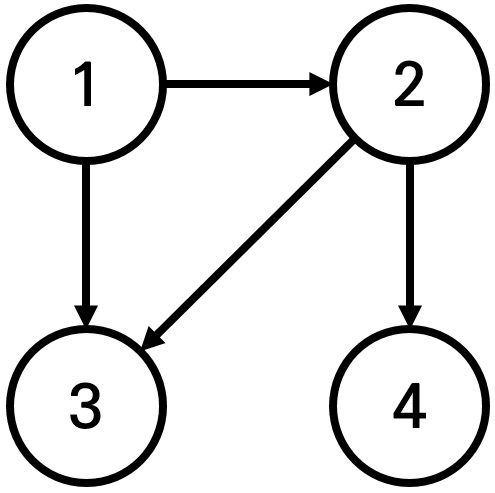

## 1. 18405번: **경쟁적 전염**

[18405번: 경쟁적 전염](https://www.acmicpc.net/problem/18405)

N X N 크기의 시험관에 1~K번 바이러스가 있습니다.

상하좌우로 증식해나가는 바이러스이고 낮은 번호의 바이러스가 먼저 증식합니다.

주어진 S초 후에 X, Y 칸에는 어떤 바이러스가 증식해있을지 구하는 문제 입니다.

### 문제 해결 아이디어

아래와 같은 순서로 진행하여 문제를 해결할 수 있습니다.

- 그래프 안에 있는 바이러스의 정보 ( 바이러스 종류, 전염 시간, x좌표, y좌표 )를 배열에 담습니다.
- 낮은 번호부터 전염을 시키기 해서 오름차 순 정렬을 해줍니다.
- 모든 바이러스들을 큐에 담아서 4방향으로 전염을 시킵니다.
- 지정된 초에 도달하면 종료합니다.

마지막으로 모든 큐에 작업이 종료된 후 x, y 위치의 값을 출력하면 정답 판정을 받을 수 있습니다.

### 정답 코드 예시

```tsx
// 1. 18405번: 경쟁적 전염
let fs = require("fs");
let input = fs.readFileSync("/dev/stdin").toString().split("\n");
class Queue {
  constructor() {
    this.storage = new Map();
    this.front = 0;
    this.rear = 0;
  }

  size() {
    return this.storage.size;
  }

  add(value) {
    if (!this.storage.size) {
      this.storage.set(0, value);
    } else {
      this.rear += 1;
      this.storage.set(this.rear, value);
    }
  }

  pop() {
    const item = this.storage.get(this.front);
    if (this.storage.size === 1) {
      this.storage.clear();
      this.front = 0;
      this.rear = 0;
    } else {
      this.storage.delete(this.front);
      this.front += 1;
    }
    return item;
  }
}
const [n, k] = input[0].split(" ").map(Number);
// s초 후에 x,y 좌표에 있는 바이러스 체크해야함
const [targetS, targetX, targetY] = input[n + 1].split(" ").map(Number);
const graph = [];
const virusData = [];
const dx = [-1, 0, 1, 0];
const dy = [0, 1, 0, -1];

for (let i = 0; i < n; i++) {
  graph[i] = input[i + 1].split(" ").map(Number);
  for (let j = 0; j < n; j++) {
    if (graph[i][j] !== 0) {
      // 바이러스 종류, 시간, x, y
      virusData.push([graph[i][j], 0, i, j]);
    }
  }
}
// 낮은 번호의 바이러스가 먼저 증식하기에 정렬하기
virusData.sort((a, b) => a[0] - b[0]);
const queue = new Queue();
// 낮은 번호 바이러스 부터 큐에 삽입
for (let v of virusData) queue.add(v);

while (queue.size() !== 0) {
  const [virus, s, x, y] = queue.pop();
  // 지정된 시간이 완료되면 종료
  if (s === targetS) break;
  // 4방향으로 바이러스 전파하기
  for (let i = 0; i < 4; i++) {
    let nx = x + dx[i];
    let ny = y + dy[i];
    if (nx < 0 || nx >= n || ny < 0 || ny >= n) continue;
    // 바이러스가 아직 퍼지지 않은 칸인경우
    if (graph[nx][ny] === 0) {
      graph[nx][ny] = virus;
      queue.add([virus, s + 1, nx, ny]);
    }
  }
}
console.log(graph[targetX - 1][targetY - 1]);
```

## 2. 18352번: **특정 거리의 도시 찾기**

[18352번: 특정 거리의 도시 찾기](https://www.acmicpc.net/problem/18352)



도시가 N개 있고 거리를 K로 할 때 출발 도시에서 K만큼 갔을 때 도달 할 수 있는 도시를 찾는 문제 입니다.

### 문제 해결 아이디어

- 인접한 노드 (예시: 1은 ⇒ 2, 3이 인접 노드)를 큐에 넣고 거리를 담는 visited 배열에 최단 거리를 저장합니다. (더 이상 진행할 수 없을 때까지)
- 저장한 visited 배열에 저장한 최단거리와 K가 일치하는 도시를 출력합니다.

### 정답 코드 예시

```tsx
// 2. 18352번: 특정 거리의 도시 찾기
let fs = require("fs");
let input = fs.readFileSync("/dev/stdin").toString().split("\n");
class Queue {
  constructor() {
    this.storage = new Map();
    this.front = 0;
    this.rear = 0;
  }

  size() {
    return this.storage.size;
  }

  add(value) {
    if (!this.storage.size) {
      this.storage.set(0, value);
    } else {
      this.rear += 1;
      this.storage.set(this.rear, value);
    }
  }

  pop() {
    const item = this.storage.get(this.front);
    if (this.storage.size === 1) {
      this.storage.clear();
      this.front = 0;
      this.rear = 0;
    } else {
      this.storage.delete(this.front);
      this.front += 1;
    }
    return item;
  }
}
let [n, m, k, x] = input[0].split(" ").map(Number);
const graph = [[]];
for (let i = 1; i <= n; i++) graph[i] = [];
// 모든 도시에 대한 최단 거리 초기화
const visited = new Array(n + 1).fill(-1);
visited[x] = 0; // 출발 도시까지의 거리는 0으로 설정
let found = false;
for (let i = 1; i <= m; i++) {
  const [a, b] = input[i].split(" ").map(Number);
  graph[a].push(b);
}
const queue = new Queue();
queue.add(x);
while (queue.size() !== 0) {
  const v = queue.pop();
  for (let city of graph[v]) {
    if (visited[city] === -1) {
      visited[city] = visited[v] + 1;
      queue.add(city);
    }
  }
}
for (let i = 1; i <= n; i++) {
  if (visited[i] === k) {
    console.log(i);
    found = true;
  }
}
if (!found) console.log(-1);
```